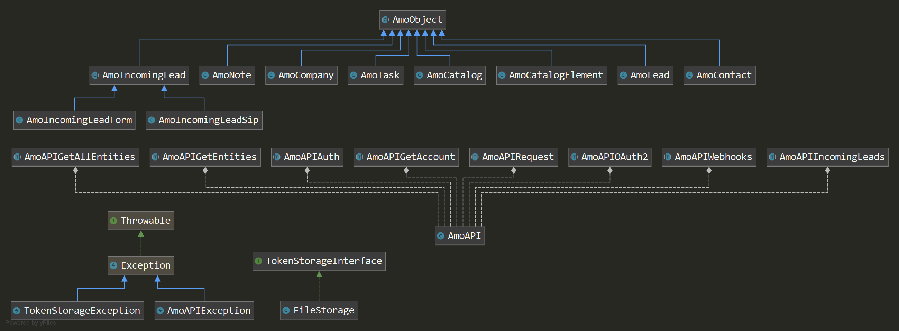

# amoCRM API PHP Wrapper

  

[](//packagist.org/packages/andrey-tech/amocrm-api-php)
[](//packagist.org/packages/andrey-tech/amocrm-api-php)
[](https://github.com/andrey-tech/amocrm-api-php/stargazers)
[](https://github.com/andrey-tech/amocrm-api-php/network)
[](https://github.com/andrey-tech/amocrm-api-php/watchers)
[](//packagist.org/packages/andrey-tech/amocrm-api-php)

Простая обертка на PHP7+ для работы с REST API [amoCRM](https://www.amocrm.ru) **v2 (версии 2)** с авторизацией по протоколу oAuth 2.0
или по API-ключу пользователя, троттлингом запросов к API, блокировкой одновременного обновления одной сущности
и логированием запросов/ответов к API в файл.

Данная библиотека была создана для удовлетворения
[новых требований amoCRM](https://www.amocrm.ru/developers/content/integrations/requirements),
предъявляемых к публичным интеграциям:
> Публичные интеграции должны использовать механизм авторизации oAuth 2.0,
использование механизма API ключей не допускается. Требование с февраля 2020 года.

С 1 июля 2020 г. информация о API-ключе пользователя стала недоступна в интерфейсе amoCRM.

В настоящее время актуальной версией является [REST API amoCRM **v4 (версия 4)**](https://www.amocrm.ru/developers/content/crm_platform/api-reference) (запросы к API отправляются на /api/v4/).  

## Документация по REST API amoCRM **v2**

Документация по REST API **v2** теперь недоступна на русскоязычной версии сайта amoCRM.
На англоязычной версии сайта эта документация перенесена в раздел [API V2 GENERAL METHODS](https://www.amocrm.com/developers/).

Архив документации по REST API amoCRM **v2** в формате HTML вынесен в самостоятельный [репозиторий](https://github.com/andrey-tech/amocrm-api-v2-docs).   
Ниже приведены ссылки на отдельные HTML-файлы этого архива:

- [Аккаунт](https://htmlpreview.github.io/?https://github.com/andrey-tech/amocrm-api-v2-docs/blob/master/docs/account.html) 
- [Авторизация](https://htmlpreview.github.io/?https://github.com/andrey-tech/amocrm-api-v2-docs/blob/master/docs/auth.html)
- [Компании](https://htmlpreview.github.io/?https://github.com/andrey-tech/amocrm-api-v2-docs/blob/master/docs/companies.html)
- [Контакты](https://htmlpreview.github.io/?https://github.com/andrey-tech/amocrm-api-v2-docs/blob/master/docs/contacts.html)
- [Сделки](https://htmlpreview.github.io/?https://github.com/andrey-tech/amocrm-api-v2-docs/blob/master/docs/leads.html)
- [События](https://htmlpreview.github.io/?https://github.com/andrey-tech/amocrm-api-v2-docs/blob/master/docs/notes.html)
- [Задачи](https://htmlpreview.github.io/?https://github.com/andrey-tech/amocrm-api-v2-docs/blob/master/docs/tasks.html)
- [Списки](https://htmlpreview.github.io/?https://github.com/andrey-tech/amocrm-api-v2-docs/blob/master/docs/catalogs.html)
- [Элементы списков](https://htmlpreview.github.io/?https://github.com/andrey-tech/amocrm-api-v2-docs/blob/master/docs/catalog-elements.html)
- [Неразобранное](https://htmlpreview.github.io/?https://github.com/andrey-tech/amocrm-api-v2-docs/blob/master/docs/unsorted.html)
- [Webhooks](https://htmlpreview.github.io/?https://github.com/andrey-tech/amocrm-api-v2-docs/blob/master/docs/webhooks.html)
- [Покупатели](https://htmlpreview.github.io/?https://github.com/andrey-tech/amocrm-api-v2-docs/blob/master/docs/customers.html)
- [Дополнительные поля](https://htmlpreview.github.io/?https://github.com/andrey-tech/amocrm-api-v2-docs/blob/master/docs/custom_fields.html)
- [Виджеты](https://htmlpreview.github.io/?https://github.com/andrey-tech/amocrm-api-v2-docs/blob/master/docs/widgets.html)
- [Товары](https://htmlpreview.github.io/?https://github.com/andrey-tech/amocrm-api-v2-docs/blob/master/docs/products.html)
- [Воронки и этапы продаж](https://htmlpreview.github.io/?https://github.com/andrey-tech/amocrm-api-v2-docs/blob/master/docs/pipelines.html)
- [Логирование звонков](https://htmlpreview.github.io/?https://github.com/andrey-tech/amocrm-api-v2-docs/blob/master/docs/calls-add.html)
- [Уведомление о звонке](https://htmlpreview.github.io/?https://github.com/andrey-tech/amocrm-api-v2-docs/blob/master/docs/call-event.html)
- [Коды ошибок](https://htmlpreview.github.io/?https://github.com/andrey-tech/amocrm-api-v2-docs/blob/master/docs/errors.html)
- [Ограничения и рекомендации](https://htmlpreview.github.io/?https://github.com/andrey-tech/amocrm-api-v2-docs/blob/master/docs/recommendations.html)

## Содержание

<!-- MarkdownTOC levels="1,2,3,4,5,6" autoanchor="true" autolink="true" -->

- [Требования](#%D0%A2%D1%80%D0%B5%D0%B1%D0%BE%D0%B2%D0%B0%D0%BD%D0%B8%D1%8F)
- [Установка](#%D0%A3%D1%81%D1%82%D0%B0%D0%BD%D0%BE%D0%B2%D0%BA%D0%B0)
- [Авторизация](#%D0%90%D0%B2%D1%82%D0%BE%D1%80%D0%B8%D0%B7%D0%B0%D1%86%D0%B8%D1%8F)
    - [Авторизация по протоколу oAuth 2.0 \(актуальный метод\)](#%D0%90%D0%B2%D1%82%D0%BE%D1%80%D0%B8%D0%B7%D0%B0%D1%86%D0%B8%D1%8F-%D0%BF%D0%BE-%D0%BF%D1%80%D0%BE%D1%82%D0%BE%D0%BA%D0%BE%D0%BB%D1%83-oauth-20-%D0%B0%D0%BA%D1%82%D1%83%D0%B0%D0%BB%D1%8C%D0%BD%D1%8B%D0%B9-%D0%BC%D0%B5%D1%82%D0%BE%D0%B4)
        - [Первичная авторизация и обмен кода авторизации на access токен и refresh токен](#%D0%9F%D0%B5%D1%80%D0%B2%D0%B8%D1%87%D0%BD%D0%B0%D1%8F-%D0%B0%D0%B2%D1%82%D0%BE%D1%80%D0%B8%D0%B7%D0%B0%D1%86%D0%B8%D1%8F-%D0%B8-%D0%BE%D0%B1%D0%BC%D0%B5%D0%BD-%D0%BA%D0%BE%D0%B4%D0%B0-%D0%B0%D0%B2%D1%82%D0%BE%D1%80%D0%B8%D0%B7%D0%B0%D1%86%D0%B8%D0%B8-%D0%BD%D0%B0-access-%D1%82%D0%BE%D0%BA%D0%B5%D0%BD-%D0%B8-refresh-%D1%82%D0%BE%D0%BA%D0%B5%D0%BD)
        - [Последующие авторизации](#%D0%9F%D0%BE%D1%81%D0%BB%D0%B5%D0%B4%D1%83%D1%8E%D1%89%D0%B8%D0%B5-%D0%B0%D0%B2%D1%82%D0%BE%D1%80%D0%B8%D0%B7%D0%B0%D1%86%D0%B8%D0%B8)
        - [Хранение access и refresh токенов](#%D0%A5%D1%80%D0%B0%D0%BD%D0%B5%D0%BD%D0%B8%D0%B5-access-%D0%B8-refresh-%D1%82%D0%BE%D0%BA%D0%B5%D0%BD%D0%BE%D0%B2)
            - [Интерфейс `TokenStorageInterface`](#%D0%98%D0%BD%D1%82%D0%B5%D1%80%D1%84%D0%B5%D0%B9%D1%81-tokenstorageinterface)
            - [Класс `FileStorage`](#%D0%9A%D0%BB%D0%B0%D1%81%D1%81-filestorage)
            - [Использование собственного класса для сохранения токенов](#%D0%98%D1%81%D0%BF%D0%BE%D0%BB%D1%8C%D0%B7%D0%BE%D0%B2%D0%B0%D0%BD%D0%B8%D0%B5-%D1%81%D0%BE%D0%B1%D1%81%D1%82%D0%B2%D0%B5%D0%BD%D0%BD%D0%BE%D0%B3%D0%BE-%D0%BA%D0%BB%D0%B0%D1%81%D1%81%D0%B0-%D0%B4%D0%BB%D1%8F-%D1%81%D0%BE%D1%85%D1%80%D0%B0%D0%BD%D0%B5%D0%BD%D0%B8%D1%8F-%D1%82%D0%BE%D0%BA%D0%B5%D0%BD%D0%BE%D0%B2)
        - [Проверка наличия первичной авторизации](#%D0%9F%D1%80%D0%BE%D0%B2%D0%B5%D1%80%D0%BA%D0%B0-%D0%BD%D0%B0%D0%BB%D0%B8%D1%87%D0%B8%D1%8F-%D0%BF%D0%B5%D1%80%D0%B2%D0%B8%D1%87%D0%BD%D0%BE%D0%B9-%D0%B0%D0%B2%D1%82%D0%BE%D1%80%D0%B8%D0%B7%D0%B0%D1%86%D0%B8%D0%B8)
    - [Авторизация по API-ключу пользователя \(устаревший метод\)](#%D0%90%D0%B2%D1%82%D0%BE%D1%80%D0%B8%D0%B7%D0%B0%D1%86%D0%B8%D1%8F-%D0%BF%D0%BE-api-%D0%BA%D0%BB%D1%8E%D1%87%D1%83-%D0%BF%D0%BE%D0%BB%D1%8C%D0%B7%D0%BE%D0%B2%D0%B0%D1%82%D0%B5%D0%BB%D1%8F-%D1%83%D1%81%D1%82%D0%B0%D1%80%D0%B5%D0%B2%D1%88%D0%B8%D0%B9-%D0%BC%D0%B5%D1%82%D0%BE%D0%B4)
    - [Одновременная авторизация в нескольких аккаунтах amoCRM](#%D0%9E%D0%B4%D0%BD%D0%BE%D0%B2%D1%80%D0%B5%D0%BC%D0%B5%D0%BD%D0%BD%D0%B0%D1%8F-%D0%B0%D0%B2%D1%82%D0%BE%D1%80%D0%B8%D0%B7%D0%B0%D1%86%D0%B8%D1%8F-%D0%B2-%D0%BD%D0%B5%D1%81%D0%BA%D0%BE%D0%BB%D1%8C%D0%BA%D0%B8%D1%85-%D0%B0%D0%BA%D0%BA%D0%B0%D1%83%D0%BD%D1%82%D0%B0%D1%85-amocrm)
- [Параметры настройки](#%D0%9F%D0%B0%D1%80%D0%B0%D0%BC%D0%B5%D1%82%D1%80%D1%8B-%D0%BD%D0%B0%D1%81%D1%82%D1%80%D0%BE%D0%B9%D0%BA%D0%B8)
- [Работа с сущностями amoCRM](#%D0%A0%D0%B0%D0%B1%D0%BE%D1%82%D0%B0-%D1%81-%D1%81%D1%83%D1%89%D0%BD%D0%BE%D1%81%D1%82%D1%8F%D0%BC%D0%B8-amocrm)
    - [Список методов и констант моделей](#%D0%A1%D0%BF%D0%B8%D1%81%D0%BE%D0%BA-%D0%BC%D0%B5%D1%82%D0%BE%D0%B4%D0%BE%D0%B2-%D0%B8-%D0%BA%D0%BE%D0%BD%D1%81%D1%82%D0%B0%D0%BD%D1%82-%D0%BC%D0%BE%D0%B4%D0%B5%D0%BB%D0%B5%D0%B9)
        - [Базовый класс моделей `AmoObject`](#%D0%91%D0%B0%D0%B7%D0%BE%D0%B2%D1%8B%D0%B9-%D0%BA%D0%BB%D0%B0%D1%81%D1%81-%D0%BC%D0%BE%D0%B4%D0%B5%D0%BB%D0%B5%D0%B9-amoobject)
        - [Класс `AmoContact` - модель контакта](#%D0%9A%D0%BB%D0%B0%D1%81%D1%81-amocontact---%D0%BC%D0%BE%D0%B4%D0%B5%D0%BB%D1%8C-%D0%BA%D0%BE%D0%BD%D1%82%D0%B0%D0%BA%D1%82%D0%B0)
        - [Класс `AmoCompany` - модель компании](#%D0%9A%D0%BB%D0%B0%D1%81%D1%81-amocompany---%D0%BC%D0%BE%D0%B4%D0%B5%D0%BB%D1%8C-%D0%BA%D0%BE%D0%BC%D0%BF%D0%B0%D0%BD%D0%B8%D0%B8)
        - [Класс `AmoLead` - модель сделки](#%D0%9A%D0%BB%D0%B0%D1%81%D1%81-amolead---%D0%BC%D0%BE%D0%B4%D0%B5%D0%BB%D1%8C-%D1%81%D0%B4%D0%B5%D0%BB%D0%BA%D0%B8)
        - [Класс `AmoTask` - модель задачи](#%D0%9A%D0%BB%D0%B0%D1%81%D1%81-amotask---%D0%BC%D0%BE%D0%B4%D0%B5%D0%BB%D1%8C-%D0%B7%D0%B0%D0%B4%D0%B0%D1%87%D0%B8)
        - [Класс `AmoNote` - модель события \(примечания\)](#%D0%9A%D0%BB%D0%B0%D1%81%D1%81-amonote---%D0%BC%D0%BE%D0%B4%D0%B5%D0%BB%D1%8C-%D1%81%D0%BE%D0%B1%D1%8B%D1%82%D0%B8%D1%8F-%D0%BF%D1%80%D0%B8%D0%BC%D0%B5%D1%87%D0%B0%D0%BD%D0%B8%D1%8F)
        - [Класс `AmoCatalog` - модель списка \(каталога\)](#%D0%9A%D0%BB%D0%B0%D1%81%D1%81-amocatalog---%D0%BC%D0%BE%D0%B4%D0%B5%D0%BB%D1%8C-%D1%81%D0%BF%D0%B8%D1%81%D0%BA%D0%B0-%D0%BA%D0%B0%D1%82%D0%B0%D0%BB%D0%BE%D0%B3%D0%B0)
        - [Класс `AmoCatalogElement` - модель элемента списка \(каталога\)](#%D0%9A%D0%BB%D0%B0%D1%81%D1%81-amocatalogelement---%D0%BC%D0%BE%D0%B4%D0%B5%D0%BB%D1%8C-%D1%8D%D0%BB%D0%B5%D0%BC%D0%B5%D0%BD%D1%82%D0%B0-%D1%81%D0%BF%D0%B8%D1%81%D0%BA%D0%B0-%D0%BA%D0%B0%D1%82%D0%B0%D0%BB%D0%BE%D0%B3%D0%B0)
        - [Класс `AmoIncomingLead` - базовая модель заявки из неразобранного](#%D0%9A%D0%BB%D0%B0%D1%81%D1%81-amoincominglead---%D0%B1%D0%B0%D0%B7%D0%BE%D0%B2%D0%B0%D1%8F-%D0%BC%D0%BE%D0%B4%D0%B5%D0%BB%D1%8C-%D0%B7%D0%B0%D1%8F%D0%B2%D0%BA%D0%B8-%D0%B8%D0%B7-%D0%BD%D0%B5%D1%80%D0%B0%D0%B7%D0%BE%D0%B1%D1%80%D0%B0%D0%BD%D0%BD%D0%BE%D0%B3%D0%BE)
            - [Общие методы для работы с заявками из неразобранного](#%D0%9E%D0%B1%D1%89%D0%B8%D0%B5-%D0%BC%D0%B5%D1%82%D0%BE%D0%B4%D1%8B-%D0%B4%D0%BB%D1%8F-%D1%80%D0%B0%D0%B1%D0%BE%D1%82%D1%8B-%D1%81-%D0%B7%D0%B0%D1%8F%D0%B2%D0%BA%D0%B0%D0%BC%D0%B8-%D0%B8%D0%B7-%D0%BD%D0%B5%D1%80%D0%B0%D0%B7%D0%BE%D0%B1%D1%80%D0%B0%D0%BD%D0%BD%D0%BE%D0%B3%D0%BE)
            - [Класс `AmoIncomingLeadForm` - модель заявки из неразобранного при добавлении из веб-формы](#%D0%9A%D0%BB%D0%B0%D1%81%D1%81-amoincomingleadform---%D0%BC%D0%BE%D0%B4%D0%B5%D0%BB%D1%8C-%D0%B7%D0%B0%D1%8F%D0%B2%D0%BA%D0%B8-%D0%B8%D0%B7-%D0%BD%D0%B5%D1%80%D0%B0%D0%B7%D0%BE%D0%B1%D1%80%D0%B0%D0%BD%D0%BD%D0%BE%D0%B3%D0%BE-%D0%BF%D1%80%D0%B8-%D0%B4%D0%BE%D0%B1%D0%B0%D0%B2%D0%BB%D0%B5%D0%BD%D0%B8%D0%B8-%D0%B8%D0%B7-%D0%B2%D0%B5%D0%B1-%D1%84%D0%BE%D1%80%D0%BC%D1%8B)
            - [Класс `AmoIncomingLeadSip` - модель заявки из неразобранного с типом входящий звонок](#%D0%9A%D0%BB%D0%B0%D1%81%D1%81-amoincomingleadsip---%D0%BC%D0%BE%D0%B4%D0%B5%D0%BB%D1%8C-%D0%B7%D0%B0%D1%8F%D0%B2%D0%BA%D0%B8-%D0%B8%D0%B7-%D0%BD%D0%B5%D1%80%D0%B0%D0%B7%D0%BE%D0%B1%D1%80%D0%B0%D0%BD%D0%BD%D0%BE%D0%B3%D0%BE-%D1%81-%D1%82%D0%B8%D0%BF%D0%BE%D0%BC-%D0%B2%D1%85%D0%BE%D0%B4%D1%8F%D1%89%D0%B8%D0%B9-%D0%B7%D0%B2%D0%BE%D0%BD%D0%BE%D0%BA)
    - [Методы для загрузки сущностей](#%D0%9C%D0%B5%D1%82%D0%BE%D0%B4%D1%8B-%D0%B4%D0%BB%D1%8F-%D0%B7%D0%B0%D0%B3%D1%80%D1%83%D0%B7%D0%BA%D0%B8-%D1%81%D1%83%D1%89%D0%BD%D0%BE%D1%81%D1%82%D0%B5%D0%B9)
    - [Методы для пакетного сохранения сущностей](#%D0%9C%D0%B5%D1%82%D0%BE%D0%B4%D1%8B-%D0%B4%D0%BB%D1%8F-%D0%BF%D0%B0%D0%BA%D0%B5%D1%82%D0%BD%D0%BE%D0%B3%D0%BE-%D1%81%D0%BE%D1%85%D1%80%D0%B0%D0%BD%D0%B5%D0%BD%D0%B8%D1%8F-%D1%81%D1%83%D1%89%D0%BD%D0%BE%D1%81%D1%82%D0%B5%D0%B9)
    - [Методы для пакетного удаления сущностей](#%D0%9C%D0%B5%D1%82%D0%BE%D0%B4%D1%8B-%D0%B4%D0%BB%D1%8F-%D0%BF%D0%B0%D0%BA%D0%B5%D1%82%D0%BD%D0%BE%D0%B3%D0%BE-%D1%83%D0%B4%D0%B0%D0%BB%D0%B5%D0%BD%D0%B8%D1%8F-%D1%81%D1%83%D1%89%D0%BD%D0%BE%D1%81%D1%82%D0%B5%D0%B9)
    - [Методы для webhooks](#%D0%9C%D0%B5%D1%82%D0%BE%D0%B4%D1%8B-%D0%B4%D0%BB%D1%8F-webhooks)
    - [Методы для неразобранного](#%D0%9C%D0%B5%D1%82%D0%BE%D0%B4%D1%8B-%D0%B4%D0%BB%D1%8F-%D0%BD%D0%B5%D1%80%D0%B0%D0%B7%D0%BE%D0%B1%D1%80%D0%B0%D0%BD%D0%BD%D0%BE%D0%B3%D0%BE)
    - [Дополнительные методы](#%D0%94%D0%BE%D0%BF%D0%BE%D0%BB%D0%BD%D0%B8%D1%82%D0%B5%D0%BB%D1%8C%D0%BD%D1%8B%D0%B5-%D0%BC%D0%B5%D1%82%D0%BE%D0%B4%D1%8B)
- [Блокировка одновременного обновления одной сущности](#%D0%91%D0%BB%D0%BE%D0%BA%D0%B8%D1%80%D0%BE%D0%B2%D0%BA%D0%B0-%D0%BE%D0%B4%D0%BD%D0%BE%D0%B2%D1%80%D0%B5%D0%BC%D0%B5%D0%BD%D0%BD%D0%BE%D0%B3%D0%BE-%D0%BE%D0%B1%D0%BD%D0%BE%D0%B2%D0%BB%D0%B5%D0%BD%D0%B8%D1%8F-%D0%BE%D0%B4%D0%BD%D0%BE%D0%B9-%D1%81%D1%83%D1%89%D0%BD%D0%BE%D1%81%D1%82%D0%B8)
- [Троттлинг запросов к API](#%D0%A2%D1%80%D0%BE%D1%82%D1%82%D0%BB%D0%B8%D0%BD%D0%B3-%D0%B7%D0%B0%D0%BF%D1%80%D0%BE%D1%81%D0%BE%D0%B2-%D0%BA-api)
- [Отладочный режим и логирование](#%D0%9E%D1%82%D0%BB%D0%B0%D0%B4%D0%BE%D1%87%D0%BD%D1%8B%D0%B9-%D1%80%D0%B5%D0%B6%D0%B8%D0%BC-%D0%B8-%D0%BB%D0%BE%D0%B3%D0%B8%D1%80%D0%BE%D0%B2%D0%B0%D0%BD%D0%B8%D0%B5)
- [Обработка ошибок](#%D0%9E%D0%B1%D1%80%D0%B0%D0%B1%D0%BE%D1%82%D0%BA%D0%B0-%D0%BE%D1%88%D0%B8%D0%B1%D0%BE%D0%BA)
- [Примеры](#%D0%9F%D1%80%D0%B8%D0%BC%D0%B5%D1%80%D1%8B)
    - [Работа с контактами](#%D0%A0%D0%B0%D0%B1%D0%BE%D1%82%D0%B0-%D1%81-%D0%BA%D0%BE%D0%BD%D1%82%D0%B0%D0%BA%D1%82%D0%B0%D0%BC%D0%B8)
    - [Работа с компаниями](#%D0%A0%D0%B0%D0%B1%D0%BE%D1%82%D0%B0-%D1%81-%D0%BA%D0%BE%D0%BC%D0%BF%D0%B0%D0%BD%D0%B8%D1%8F%D0%BC%D0%B8)
    - [Работа со сделками](#%D0%A0%D0%B0%D0%B1%D0%BE%D1%82%D0%B0-%D1%81%D0%BE-%D1%81%D0%B4%D0%B5%D0%BB%D0%BA%D0%B0%D0%BC%D0%B8)
    - [Работа с событиями](#%D0%A0%D0%B0%D0%B1%D0%BE%D1%82%D0%B0-%D1%81-%D1%81%D0%BE%D0%B1%D1%8B%D1%82%D0%B8%D1%8F%D0%BC%D0%B8)
    - [Работа с задачами](#%D0%A0%D0%B0%D0%B1%D0%BE%D1%82%D0%B0-%D1%81-%D0%B7%D0%B0%D0%B4%D0%B0%D1%87%D0%B0%D0%BC%D0%B8)
    - [Работа со списками \(каталогами\)](#%D0%A0%D0%B0%D0%B1%D0%BE%D1%82%D0%B0-%D1%81%D0%BE-%D1%81%D0%BF%D0%B8%D1%81%D0%BA%D0%B0%D0%BC%D0%B8-%D0%BA%D0%B0%D1%82%D0%B0%D0%BB%D0%BE%D0%B3%D0%B0%D0%BC%D0%B8)
    - [Работа с элементами списков \(каталогов\)](#%D0%A0%D0%B0%D0%B1%D0%BE%D1%82%D0%B0-%D1%81-%D1%8D%D0%BB%D0%B5%D0%BC%D0%B5%D0%BD%D1%82%D0%B0%D0%BC%D0%B8-%D1%81%D0%BF%D0%B8%D1%81%D0%BA%D0%BE%D0%B2-%D0%BA%D0%B0%D1%82%D0%B0%D0%BB%D0%BE%D0%B3%D0%BE%D0%B2)
    - [Работа с webhooks](#%D0%A0%D0%B0%D0%B1%D0%BE%D1%82%D0%B0-%D1%81-webhooks)
    - [Работа с заявками из неразобранного](#%D0%A0%D0%B0%D0%B1%D0%BE%D1%82%D0%B0-%D1%81-%D0%B7%D0%B0%D1%8F%D0%B2%D0%BA%D0%B0%D0%BC%D0%B8-%D0%B8%D0%B7-%D0%BD%D0%B5%D1%80%D0%B0%D0%B7%D0%BE%D0%B1%D1%80%D0%B0%D0%BD%D0%BD%D0%BE%D0%B3%D0%BE)
    - [Работа с несколькими поддоменами](#%D0%A0%D0%B0%D0%B1%D0%BE%D1%82%D0%B0-%D1%81-%D0%BD%D0%B5%D1%81%D0%BA%D0%BE%D0%BB%D1%8C%D0%BA%D0%B8%D0%BC%D0%B8-%D0%BF%D0%BE%D0%B4%D0%B4%D0%BE%D0%BC%D0%B5%D0%BD%D0%B0%D0%BC%D0%B8)
    - [Отладка и логирование](#%D0%9E%D1%82%D0%BB%D0%B0%D0%B4%D0%BA%D0%B0-%D0%B8-%D0%BB%D0%BE%D0%B3%D0%B8%D1%80%D0%BE%D0%B2%D0%B0%D0%BD%D0%B8%D0%B5)
- [UML-диаграмма классов](#uml-%D0%B4%D0%B8%D0%B0%D0%B3%D1%80%D0%B0%D0%BC%D0%BC%D0%B0-%D0%BA%D0%BB%D0%B0%D1%81%D1%81%D0%BE%D0%B2)
- [Автор](#%D0%90%D0%B2%D1%82%D0%BE%D1%80)
- [Лицензия](#%D0%9B%D0%B8%D1%86%D0%B5%D0%BD%D0%B7%D0%B8%D1%8F)

<!-- /MarkdownTOC -->

<a id="%D0%A2%D1%80%D0%B5%D0%B1%D0%BE%D0%B2%D0%B0%D0%BD%D0%B8%D1%8F"></a>
## Требования

- PHP >= 7.0.
- Произвольный автозагрузчик классов, реализующий стандарт [PSR-4](https://www.php-fig.org/psr/psr-4/).

<a id="%D0%A3%D1%81%D1%82%D0%B0%D0%BD%D0%BE%D0%B2%D0%BA%D0%B0"></a>
## Установка

Установка через composer:
```
$ composer require andrey-tech/amocrm-api-php:"^2.7"
```

или путем добавления:

```
"andrey-tech/amocrm-api-php": "^2.7"
```

в секцию require файла composer.json.

<a id="%D0%90%D0%B2%D1%82%D0%BE%D1%80%D0%B8%D0%B7%D0%B0%D1%86%D0%B8%D1%8F"></a>
## Авторизация

<a id="%D0%90%D0%B2%D1%82%D0%BE%D1%80%D0%B8%D0%B7%D0%B0%D1%86%D0%B8%D1%8F-%D0%BF%D0%BE-%D0%BF%D1%80%D0%BE%D1%82%D0%BE%D0%BA%D0%BE%D0%BB%D1%83-oauth-20-%D0%B0%D0%BA%D1%82%D1%83%D0%B0%D0%BB%D1%8C%D0%BD%D1%8B%D0%B9-%D0%BC%D0%B5%D1%82%D0%BE%D0%B4"></a>
### Авторизация по протоколу oAuth 2.0 ([актуальный метод](https://www.amocrm.ru/developers/content/oauth/oauth))

- `static AmoAPI::oAuth2(string $subdomain, string $clientId, string $clientSecret, string $redirectUri, string $authCode = null) :array`  
    - `$subdomain` - поддомен или полный домен amoCRM;
    - `$clientId` - ID интеграции;
    - `$clientSecret` - секрет интеграции;
    - `$redirectUri` - URI перенаправления;
    - `$authCode` - код авторизации (временный ключ) для обмена на access токен и refresh токен.

<a id="%D0%9F%D0%B5%D1%80%D0%B2%D0%B8%D1%87%D0%BD%D0%B0%D1%8F-%D0%B0%D0%B2%D1%82%D0%BE%D1%80%D0%B8%D0%B7%D0%B0%D1%86%D0%B8%D1%8F-%D0%B8-%D0%BE%D0%B1%D0%BC%D0%B5%D0%BD-%D0%BA%D0%BE%D0%B4%D0%B0-%D0%B0%D0%B2%D1%82%D0%BE%D1%80%D0%B8%D0%B7%D0%B0%D1%86%D0%B8%D0%B8-%D0%BD%D0%B0-access-%D1%82%D0%BE%D0%BA%D0%B5%D0%BD-%D0%B8-refresh-%D1%82%D0%BE%D0%BA%D0%B5%D0%BD"></a>
#### Первичная авторизация и обмен кода авторизации на access токен и refresh токен

При первичной авторизации производится [обмен кода авторизации](https://www.amocrm.ru/developers/content/oauth/step-by-step#get_access_token) `authCode`
на access токен и refresh токен, которые сохраняются в хранилище токенов вместе с переданными значениями `$clientId`, `$clientSecret` и `$redirectUri`.

```php
use AmoCRM\{AmoAPI, AmoAPIException};
use AmoCRM\TokenStorage\TokenStorageException;

try {
    // Параметры авторизации по протоколу oAuth 2.0
    $clientId     = 'aaaaaaaa-bbbb-cccc-dddd-eeeeeeeeeeee';
    $clientSecret = 'TFPoaG2A5hp3G3o6opCL8eC9v92Mm0fKQWEHBDwIjedCmVliT4kI3XQcjOOP1s';
    $authCode     = 'eee60208cc09e3ae3506d667228038345b6578a11d4862094655f630074c8c6ed87a9d804d49b5880e';
    $redirectUri  = 'https://www.example.com/oauth2/';
    $subdomain    = 'testsubdomain';

    // Первичная авторизация
    AmoAPI::oAuth2($subdomain, $clientId, $clientSecret, $redirectUri, $authCode);

    // Получение информации об аккаунте вместе с пользователями и группами
    print_r(AmoAPI::getAccount($with = 'users,groups'));

} catch (AmoAPIException $e) {
    printf('Ошибка авторизации (%d): %s' . PHP_EOL, $e->getCode(), $e->getMessage());
} catch (TokenStorageException $e) {
    printf('Ошибка обработки токенов (%d): %s' . PHP_EOL, $e->getCode(), $e->getMessage());
}
```

<a id="%D0%9F%D0%BE%D1%81%D0%BB%D0%B5%D0%B4%D1%83%D1%8E%D1%89%D0%B8%D0%B5-%D0%B0%D0%B2%D1%82%D0%BE%D1%80%D0%B8%D0%B7%D0%B0%D1%86%D0%B8%D0%B8"></a>
#### Последующие авторизации

После первичного обмена кода авторизации на access токен и refresh токен, при последующих авторизациях, 
достаточно передать только `$subdomain` - поддомен или полный домен amoCRM.

```php
use AmoCRM\{AmoAPI, AmoAPIException};
use AmoCRM\TokenStorage\TokenStorageException;

try {

    // Последующие авторизации
    $subdomain = 'testsubdomain';
    AmoAPI::oAuth2($subdomain);

    // Получение информации об аккаунте
    print_r(AmoAPI::getAccount());

} catch (AmoAPIException $e) {
    printf('Ошибка авторизации (%d): %s' . PHP_EOL, $e->getCode(), $e->getMessage());
} catch (TokenStorageException $e) {
    printf('Ошибка обработки токенов (%d): %s' . PHP_EOL, $e->getCode(), $e->getMessage());
}
```

Получение нового access токена и refresh токена по истечении срока действия access токена происходит автоматически,
когда в ответ на запрос к API amoCRM приходит ответ с HTTP-статусом `401 Unauthorized`.

<a id="%D0%A5%D1%80%D0%B0%D0%BD%D0%B5%D0%BD%D0%B8%D0%B5-access-%D0%B8-refresh-%D1%82%D0%BE%D0%BA%D0%B5%D0%BD%D0%BE%D0%B2"></a>
#### Хранение access и refresh токенов

Сохранение и загрузка токенов выполняется с помощью классов, реализующих интерфейс `\AmoCRM\TokenStorage\TokenStorageInterface`.

<a id="%D0%98%D0%BD%D1%82%D0%B5%D1%80%D1%84%D0%B5%D0%B9%D1%81-tokenstorageinterface"></a>
##### Интерфейс `TokenStorageInterface`

Интерфейс `\AmoCRM\TokenStorage\TokenStorageInterface` определяет три метода:

- `save(array $tokens, string $domain) :void` Сохраняет параметры авторизации и токены.
    * `$tokens` - ассоциативный массив параметров авторизации и токенов:  
       `[ 'access_token' => '...', 'refresh_token' => '...', 'client_id' => '...', 'client_secret' => '...', 'redirect_uri'=> '...' ]`;
    * `$domain` - полный домен amoCRM (например, `testsubdomain.amocrm.ru`).
- `load(string $domain) :?array` Загружает параметры авторизации и токены и возвращает их.
    Метод должен возвращать `null`, когда нет сохраненных токенов.
    * `$domain` - полный домен amoCRM.
- `hasTokens(string $domain) :bool` Проверяет существуют ли токены для заданного домена amoCRM, то есть была ли выполнена первичная авторизация.
    * `$domain` - полный домен amoCRM.

<a id="%D0%9A%D0%BB%D0%B0%D1%81%D1%81-filestorage"></a>
##### Класс `FileStorage`

По умолчанию для сохранения и загрузки токенов используется класс `\AmoCRM\TokenStorage\FileStorage`,
реализующий интерфейс `\AmoCRM\TokenStorage\TokenStorageInterface`.
Класс хранит токены в JSON-файлах, с именами, соответствующими именам доменов amoCRM (например, `testsubdomain.amocrm.ru.json`).  

В параметрах, передаваемых конструктору класса, можно указать каталог для хранения файлов токенов:

- `__construct(string $storageFolder = 'tokens/')` Конструктор класса.
    * `$storageFolder` - каталог для хранения файлов токенов.

При возникновении ошибок выбрасывается исключение класса `\AmoCRM\TokenStorage\TokenStorageException`. 

<a id="%D0%98%D1%81%D0%BF%D0%BE%D0%BB%D1%8C%D0%B7%D0%BE%D0%B2%D0%B0%D0%BD%D0%B8%D0%B5-%D1%81%D0%BE%D0%B1%D1%81%D1%82%D0%B2%D0%B5%D0%BD%D0%BD%D0%BE%D0%B3%D0%BE-%D0%BA%D0%BB%D0%B0%D1%81%D1%81%D0%B0-%D0%B4%D0%BB%D1%8F-%D1%81%D0%BE%D1%85%D1%80%D0%B0%D0%BD%D0%B5%D0%BD%D0%B8%D1%8F-%D1%82%D0%BE%D0%BA%D0%B5%D0%BD%D0%BE%D0%B2"></a>
##### Использование собственного класса для сохранения токенов

Пример использования собственного класса для сохранения токенов в базе данных:
```php
use AmoCRM\{AmoAPI, AmoAPIException};
use AmoCRM\TokenStorage\DatabaseStorage;

try {
    // Параметры авторизации по протоколу oAuth 2.0
    $clientId     = 'aaaaaaaa-bbbb-cccc-dddd-eeeeeeeeeeee';
    $clientSecret = 'TFPoaG2A5hp3G3o6opCL8eC9v92Mm0fKQWEHBDwIjedCmVliT4kI3XQcjOOP1s';
    $authCode     = 'eee60208cc09e3ae3506d667228038345b6578a11d4862094655f630074c8c6ed87a9d804d49b5880e';
    $redirectUri  = 'https://www.example.com/oauth2/';
    $subdomain    = 'testsubdomain';

    // Устанавливаем объект класса, обеспечивающего сохранение токенов
    AmoAPI::$tokenStorage = new DatabaseStorage();

    // Авторизация
    AmoAPI::oAuth2($subdomain, $clientId, $clientSecret, $redirectUri, $authCode);

    // Получение информации об аккаунте
    print_r(AmoAPI::getAccount());

} catch (AmoAPIException $e) {
    printf('Ошибка авторизации (%d): %s' . PHP_EOL, $e->getCode(), $e->getMessage());
}
```

Пример класса `\AmoCRM\TokenStorage\DatabaseStorage`:
```php
<?php
namespace AmoCRM\TokenStorage;

class DatabaseStorage implements TokenStorageInterface
{
    /**
     * Сохраняет токены
     * @param  array  $tokens Токены для сохранения
     * @param  string $domain Полный домен amoCRM
     * @return void
     */
    public function save(array $tokens, string $domain)
    {
        // Здесь токены сохраняются в базе данных
    }

    /**
     * Загружает токены
     * @param  string $domain Полный домен amoCRM
     * @return array|null
     */
    public function load(string $domain)
    {
        // Здесь токены извлекаются из базы данных
    }

    /**
     * Проверяет: существуют ли токены для заданного домена amoCRM,
     * то есть была ли выполнена первичная авторизация
     * @param  string  $domain Полный домен amoCRM
     * @return boolean
     */
    public function hasTokens(string $domain) :bool
    {
        // Здесь проверяется наличие токенов в базе данных
    }
}
```

<a id="%D0%9F%D1%80%D0%BE%D0%B2%D0%B5%D1%80%D0%BA%D0%B0-%D0%BD%D0%B0%D0%BB%D0%B8%D1%87%D0%B8%D1%8F-%D0%BF%D0%B5%D1%80%D0%B2%D0%B8%D1%87%D0%BD%D0%BE%D0%B9-%D0%B0%D0%B2%D1%82%D0%BE%D1%80%D0%B8%D0%B7%D0%B0%D1%86%D0%B8%D0%B8"></a>
#### Проверка наличия первичной авторизации

Чтобы проверить, происходила ли первичная авторизация для нужного поддомена amoCRM,
можно воспользоваться методом hasTokens() интерфейса `\AmoCRM\TokenStorage\TokenStorageInterface`:

```php
use AmoCRM\{AmoAPI, AmoAPIException};
use AmoCRM\TokenStorage\{FileStorage, TokenStorageException};

try {

    // Параметры авторизации по протоколу oAuth 2.0
    $clientId     = 'aaaaaaaa-bbbb-cccc-dddd-eeeeeeeeeeee';
    $clientSecret = 'TFPoaG2A5hp3G3o6opCL8eC9v92Mm0fKQWEHBDwIjedCmVliT4kI3XQcjOOP1s';
    $authCode     = 'eee60208cc09e3ae3506d667228038345b6578a11d4862094655f630074c8c6ed87a9d804d49b5880e';
    $redirectUri  = 'https://www.example.com/oauth2/';
    $subdomain    = 'testsubdomain';

    $domain = AmoAPI::getAmoDomain($subdomain);
    $isFirstAuth = !(new FileStorage())->hasTokens($domain);

    if ($isFirstAuth) {
        // Первичная авторизация
        AmoAPI::oAuth2($subdomain, $clientId, $clientSecret, $redirectUri, $authCode);
    } else {
        // Последующие авторизации
        AmoAPI::oAuth2($subdomain);
    }

} catch (AmoAPIException $e) {
    printf('Ошибка авторизации (%d): %s' . PHP_EOL, $e->getCode(), $e->getMessage());
} catch (TokenStorageException $e) {
    printf('Ошибка обработки токенов (%d): %s' . PHP_EOL, $e->getCode(), $e->getMessage());
}
```

<a id="%D0%90%D0%B2%D1%82%D0%BE%D1%80%D0%B8%D0%B7%D0%B0%D1%86%D0%B8%D1%8F-%D0%BF%D0%BE-api-%D0%BA%D0%BB%D1%8E%D1%87%D1%83-%D0%BF%D0%BE%D0%BB%D1%8C%D0%B7%D0%BE%D0%B2%D0%B0%D1%82%D0%B5%D0%BB%D1%8F-%D1%83%D1%81%D1%82%D0%B0%D1%80%D0%B5%D0%B2%D1%88%D0%B8%D0%B9-%D0%BC%D0%B5%D1%82%D0%BE%D0%B4"></a>
### Авторизация по API-ключу пользователя ([устаревший метод](https://www.amocrm.ru/developers/content/oauth/old))

С 1 июля 2020 г. информация о API-ключе пользователя стала недоступна в интерфейсе amoCRM.

- `static AmoAPI::oauth(string $login, string $hash, string $subdomain) :array`
    - `$login` - логин пользователя;
    - `$hash` - API-ключ пользователя;
    - `$subdomain` - поддомен или полный домен amoCRM.

Пример авторизации по API-ключу пользователя.
```php
use \AmoCRM\{AmoAPI, AmoAPIException};

try {
    // Параметры авторизации по API-ключу пользователя
    $login     = 'login@example.com';
    $hash      = 'TFPoaG2A5hp3G3o6opCL8eC9v92Mm0fKQWEHBDwIjedCmVliT4kI3XQcjOOP1s';
    $subdomain = 'testsubdomain';

    // Авторизация
    AmoAPI::auth($login, $hash, $subdomain);

    // Получение информации об аккаунте
    print_r(AmoAPI::getAccount());

} catch (AmoAPIException $e) {
    printf('Ошибка авторизации (%d): %s' . PHP_EOL, $e->getCode(), $e->getMessage());
}
```

<a id="%D0%9E%D0%B4%D0%BD%D0%BE%D0%B2%D1%80%D0%B5%D0%BC%D0%B5%D0%BD%D0%BD%D0%B0%D1%8F-%D0%B0%D0%B2%D1%82%D0%BE%D1%80%D0%B8%D0%B7%D0%B0%D1%86%D0%B8%D1%8F-%D0%B2-%D0%BD%D0%B5%D1%81%D0%BA%D0%BE%D0%BB%D1%8C%D0%BA%D0%B8%D1%85-%D0%B0%D0%BA%D0%BA%D0%B0%D1%83%D0%BD%D1%82%D0%B0%D1%85-amocrm"></a>
### Одновременная авторизация в нескольких аккаунтах amoCRM

Библиотека позволяет одновременно работать с несколькими поддоменами (аккаунтами) amoCRM.
Для этого необходимо последовательно выполнить авторизацию в каждом их поддоменов.

```php
use AmoCRM\{AmoAPI, AmoAPIException};

try {
    // Авторизация в поддомене 1
    AmoAPI::oAuth2($subdomain1, $clientId1, $clientSecret1, $redirectUri1, $authCode1);

    // Авторизация в поддомене 2
    AmoAPI::auth($login2, $hash2, $subdomain2);

    //...

    // Авторизация в поддомене N
    AmoAPI::oAuth2($subdomainN, $clientIdN, $clientSecretN, $redirectUriN, $authCodeN);

} catch (AmoAPIException $e) {
    printf('Ошибка авторизации (%d): %s' . PHP_EOL, $e->getCode(), $e->getMessage());
}
```

<a id="%D0%9F%D0%B0%D1%80%D0%B0%D0%BC%D0%B5%D1%82%D1%80%D1%8B-%D0%BD%D0%B0%D1%81%D1%82%D1%80%D0%BE%D0%B9%D0%BA%D0%B8"></a>
## Параметры настройки

Все параметры настройки библиотеки устанавливаются через статические свойства класса `AmoAPI`.

| Свойство                | По умолчанию            | Описание                                                                                                                                                                                               |
|-------------------------|-------------------------|--------------------------------------------------------------------------------------------------------------------------------------------------------------------------------------------------------|
| `$debug`                | false                   | Включает отладочный режим с выводом запросов/ответов в API в STDOUT                                                                                                                                    |
| `$debugLogger`          | null                    | Устанавливает объект класса, выполняющего логирование и реализующего стандарт [PSR-3](https://www.php-fig.org/psr/psr-3/)                                                                              |
| `$throttle`             | 7                       | Устанавливает максимальное число запросов к API amoCRM в секунду ([не более 7 запросов в секунду](https://www.amocrm.ru/developers/content/api/recommendations))                                       |
| `$verifySSLCerfificate` | true                    | Включает проверку SSL/TLS-сертификата сервера amoCRM                                                                                                                                                   |
| `$SSLCertificateFile`   | 'cacert.pem'            | Устанавливает файл SSL/TLS-сертификатов X.509 корневых удостоверяющих центров (CA) в формате РЕМ (null - использовать файл, указанный в параметре curl.cainfo файла php.ini)                           |
| `$amoDomain`            | 'amocrm.ru'             | Устанавливает домен для запросов к API amoCRM                                                                                                                                                          |
| `$amoUserAgent`         | 'amoCRM-API-client/2.0' | Устанавливает НТТР заголовок UserAgent в запросах                                                                                                                                                      |
| `$amoConnectTimeout`    | 30                      | Устанавливает таймаут соединения с сервером аmoCRM, секунды                                                                                                                                            |
| `$amoTimeout`           | 30                      | Устанавливает таймаут обмена данными с сервером аmoCRM, секунды                                                                                                                                        |
| `$reAuthTimeout`        | 5                       | Устанавливает таймаут перед повторной авторизацией по API-ключу пользователя при ответе сервера '401 Unauthorized', секунды                                                                            |
| `$reAuthAttempts`       | 3                       | Устанавливает максимальное число попыток повторной авторизации по API-ключу пользователя при ответе сервера '401 Unauthorized'                                                                         |
| `$cookieFileDir`        | 'cookies/'              | Устанавливает относительный каталог для хранения файлов cookie                                                                                                                                         |
| `$lockEntityDir`        | 'lock/'                 | Устанавливает каталог для хранения lock-файлов блокировки обновления сущностей при вызове метода `AmoObject::save()`                                                                                   |
| `$lockEntityAttempts`   | 10                      | Устанавливает максимальное число попыток блокировки обновления сущности при вызове метода `AmoObject::save()` (0 - блокировка не выполняется)                                                          |
| `$lockEntityTimeout`    | 1                       | Устанавливает таймаут между попытками блокировки обновления сущности при вызове метода `AmoObject::save()`, секунды                                                                                    |
| `$limitRows`            | 500                     | Устанавливает максимальное количество сущностей, выбираемых за один запрос к серверу amoCRM ([не более 500, рекомендуется не более 250](https://www.amocrm.ru/developers/content/api/recommendations)) |
| `$tokenStorage`         | object                  | Устанавливает объект класса, обеспечивающего сохранение токенов oAuth 2.0 и реализующего интерфейс `TokenStorageInterface`. По умолчанию объект класса `FileStorage`                                   |

<a id="%D0%A0%D0%B0%D0%B1%D0%BE%D1%82%D0%B0-%D1%81-%D1%81%D1%83%D1%89%D0%BD%D0%BE%D1%81%D1%82%D1%8F%D0%BC%D0%B8-amocrm"></a>
## Работа с сущностями amoCRM

Работа с сущностями amoCRM строится с помощью:

- методов классов-моделей:
    - `AmoContact` - модель контакта;
    - `AmoCompany` - модель компании;
    - `AmoLead` - модель сделки;
    - `AmoNote` - модель события (примечания);
    - `AmoTask` - модель задачи;
    - `AmoCatalog` - модель списка (каталога);
    - `AmoCatalogElement` - модель элемента списка (каталога);
    - `AmoIncomingLead` - абстрактная базовая модель заявки из неразобранного;
    - `AmoIncomingLeadForm` - модель заявки из неразобранного при добавлении заявки из веб-формы;
    - `AmoIncomingLeadSip` - модель заявки из неразобранного с типом входящий звонок.
- дополнительных статических методов класса `AmoAPI`;
- параметров моделей, доступных через публичные свойства объектов классов-моделей.

<a id="%D0%A1%D0%BF%D0%B8%D1%81%D0%BE%D0%BA-%D0%BC%D0%B5%D1%82%D0%BE%D0%B4%D0%BE%D0%B2-%D0%B8-%D0%BA%D0%BE%D0%BD%D1%81%D1%82%D0%B0%D0%BD%D1%82-%D0%BC%D0%BE%D0%B4%D0%B5%D0%BB%D0%B5%D0%B9"></a>
### Список методов и констант моделей

<a id="%D0%91%D0%B0%D0%B7%D0%BE%D0%B2%D1%8B%D0%B9-%D0%BA%D0%BB%D0%B0%D1%81%D1%81-%D0%BC%D0%BE%D0%B4%D0%B5%D0%BB%D0%B5%D0%B9-amoobject"></a>
#### Базовый класс моделей `AmoObject`

Абстрактный базовый класс всех моделей - `AmoObject` содержит следующие общие методы:

- `__construct(array $params = [], string $subdomain = null)` Создает новый объект модели и заполняет ее.
    + `$params` - параметры модели;
    + `$subdomain` - поддомен или полный домен amoCRM. Если null, то используется поддомен последней авторизации.
- `fillById(int|string $id, array $params = []) :AmoObject` Заполняет модель данными по ID сущности.
    + `$id` - ID сущности;
    + `$params` - дополнительные параметры, передаваемые в GET-запросе к amoCRM.
- `getParams() :array` Возвращает все параметры модели.
- `getCustomFields(array|int $ids) :array` Возвращает дополнительные поля по ID полей.
    + `$ids` - ID поля или массив ID полей.
- `getCustomFieldValueById(int $id, bool $returnFirst = true, string $returnValue = 'value')` Возвращает значение дополнительного поля по ID поля.
    + `$i` - ID поля;
    + `$returnFirst` - вернуть только первое значение из списка значений;
    + `$returnValue` - имя параметра, значение которого возвращается (`value`, `enum`, `subtype`).
- `setCustomFields(array $params) :AmoObject` Устанавливает значения дополнительных полей.
    + `$params` - массив значений дополнительных полей.
- `addTags(array|string $tags) :AmoObject` Добавляет теги.
    + `$tags` - тег или массив тегов.
- `delTags(array|string $tags) :AmoObject` Удаляет теги. 
    + `$tags` - тег или массив тегов.
- `save(bool $returnResponse = false)` Сохраняет объект модели в amoCRM и возвращает ID сущности. 
    + `$returnResponse` - вернуть ответ сервера вместо ID сущности.

Константы, определяющие типы привязываемых сущностей:

- `CONTACT_TYPE = 1` - контакт;
- `LEAD_TYPE = 2` - сделка;
- `COMPANY_TYPE = 3` - компания;
- `TASK_TYPE = 4` - задача;
- `CUSTOMER_TYPE = 12` - покупатель.

<a id="%D0%9A%D0%BB%D0%B0%D1%81%D1%81-amocontact---%D0%BC%D0%BE%D0%B4%D0%B5%D0%BB%D1%8C-%D0%BA%D0%BE%D0%BD%D1%82%D0%B0%D0%BA%D1%82%D0%B0"></a>
#### Класс `AmoContact` - модель контакта

- `addLeads(array|int $id)` Привязывает сделки по ID.
- `addCustomers(array|int $id)` Привязывает покупателей по ID.
- `addCompany(int $id)` Привязывает компанию по ID.
- `getPhone()` Возвращает первый телефон контакта.
- `getEmail()` Возвращает первый e-mail контакта.

<a id="%D0%9A%D0%BB%D0%B0%D1%81%D1%81-amocompany---%D0%BC%D0%BE%D0%B4%D0%B5%D0%BB%D1%8C-%D0%BA%D0%BE%D0%BC%D0%BF%D0%B0%D0%BD%D0%B8%D0%B8"></a>
#### Класс `AmoCompany` - модель компании

- `addLeads(array|int $id)` Привязывает сделки по ID.
- `addContacts(array|int $id)` Привязывает контакты по ID.
- `addCustomers(array|int $id)` Привязывает покупателей по ID.
- `getPhone()` Возвращает первый телефон компании.
- `getEmail()` Возвращает первый e-mail компании.

<a id="%D0%9A%D0%BB%D0%B0%D1%81%D1%81-amolead---%D0%BC%D0%BE%D0%B4%D0%B5%D0%BB%D1%8C-%D1%81%D0%B4%D0%B5%D0%BB%D0%BA%D0%B8"></a>
#### Класс `AmoLead` - модель сделки

⚠ &nbsp; Для заявок из неразобранного существуют [специальные методы](#%D0%9A%D0%BB%D0%B0%D1%81%D1%81-amoincominglead---%D0%B1%D0%B0%D0%B7%D0%BE%D0%B2%D0%B0%D1%8F-%D0%BC%D0%BE%D0%B4%D0%B5%D0%BB%D1%8C-%D0%B7%D0%B0%D1%8F%D0%B2%D0%BA%D0%B8-%D0%B8%D0%B7-%D0%BD%D0%B5%D1%80%D0%B0%D0%B7%D0%BE%D0%B1%D1%80%D0%B0%D0%BD%D0%BD%D0%BE%D0%B3%D0%BE).

- `addContacts(array|int $id)` Привязывает контакты по ID контакта(ов) ([не более 40 контактов у одной сделки](https://www.amocrm.ru/developers/content/api/leads)).
- `removeContacts(array|int $id)` Отвязывает контакты по ID контакта(ов).
- `addCompany(int $id)` Привязывает компанию по ID компании.
- `removeCompany(int $id)` Отвязывает компанию по ID компании.
- `setCatalogElements(array $catalogElements)` Устанавливает элементы списков (каталогов) по ID списков.

<a id="%D0%9A%D0%BB%D0%B0%D1%81%D1%81-amotask---%D0%BC%D0%BE%D0%B4%D0%B5%D0%BB%D1%8C-%D0%B7%D0%B0%D0%B4%D0%B0%D1%87%D0%B8"></a>
#### Класс `AmoTask` - модель задачи

- `addContact(int $id)` Привязывает контакт по ID.
- `addLead(int $id)` Привязывает сделку по ID.

Константы класса, определяющие типы задач:

- `CALL_TASKTYPE = 1` - звонок;
- `MEET_TASKTYPE = 2` - встреча;
- `MAIL_TASKTYPE = 3` - написать письмо.

<a id="%D0%9A%D0%BB%D0%B0%D1%81%D1%81-amonote---%D0%BC%D0%BE%D0%B4%D0%B5%D0%BB%D1%8C-%D1%81%D0%BE%D0%B1%D1%8B%D1%82%D0%B8%D1%8F-%D0%BF%D1%80%D0%B8%D0%BC%D0%B5%D1%87%D0%B0%D0%BD%D0%B8%D1%8F"></a>
#### Класс `AmoNote` - модель события (примечания)

Константы класса, определяющие типы событий:

- `LEAD_CREATED_NOTETYPE = 1` - создание сделки;
- `CONTACT_CREATED_NOTETYPE = 2` - создание контакта;
- `LEAD_STATUS_CHANGED_NOTETYPE = 3` - изменение статуса сделки;
- `COMMON_NOTETYPE = 4` - обычное примечание;
- `COMPANY_CREATED_NOTETYPE = 12` - создание компании;
- `TASK_RESULT_NOTETYPE = 13`  результат по задаче;
- `SYSTEM_NOTETYPE = 25` - системное сообщение;
- `SMS_IN_NOTETYPE = 102` - входящее SMS сообщение;
- `SMS_OUT_NOTETYPE = 103` - исходящее SMS сообщение.

<a id="%D0%9A%D0%BB%D0%B0%D1%81%D1%81-amocatalog---%D0%BC%D0%BE%D0%B4%D0%B5%D0%BB%D1%8C-%D1%81%D0%BF%D0%B8%D1%81%D0%BA%D0%B0-%D0%BA%D0%B0%D1%82%D0%B0%D0%BB%D0%BE%D0%B3%D0%B0"></a>
#### Класс `AmoCatalog` - модель списка (каталога)

Класс `AmoCatalog` не имеет собственных специфических методов.

<a id="%D0%9A%D0%BB%D0%B0%D1%81%D1%81-amocatalogelement---%D0%BC%D0%BE%D0%B4%D0%B5%D0%BB%D1%8C-%D1%8D%D0%BB%D0%B5%D0%BC%D0%B5%D0%BD%D1%82%D0%B0-%D1%81%D0%BF%D0%B8%D1%81%D0%BA%D0%B0-%D0%BA%D0%B0%D1%82%D0%B0%D0%BB%D0%BE%D0%B3%D0%B0"></a>
#### Класс `AmoCatalogElement` - модель элемента списка (каталога)

Класс `AmoCatalogElement` не имеет собственных специфических методов.

<a id="%D0%9A%D0%BB%D0%B0%D1%81%D1%81-amoincominglead---%D0%B1%D0%B0%D0%B7%D0%BE%D0%B2%D0%B0%D1%8F-%D0%BC%D0%BE%D0%B4%D0%B5%D0%BB%D1%8C-%D0%B7%D0%B0%D1%8F%D0%B2%D0%BA%D0%B8-%D0%B8%D0%B7-%D0%BD%D0%B5%D1%80%D0%B0%D0%B7%D0%BE%D0%B1%D1%80%D0%B0%D0%BD%D0%BD%D0%BE%D0%B3%D0%BE"></a>
#### Класс `AmoIncomingLead` - базовая модель заявки из неразобранного

Работа с заявками из неразобранного существенно отличается от работы с другими сущностями amoCRM.  
Согласно [официальной документации](https://www.amocrm.ru/developers/content/api/unsorted):
> Изначально неразобранное было в отдельном хранилище и являлось отдельной сущностью именно поэтому до сих пор в интерфейсах amoCRM и в API есть особенности которые отличают поведение сделки в статусе Неразобранное от сделок в других статусах.

⚠ &nbsp; Поэтому для моделей заявок из неразобранного не работают следующие методы класса `AmoObject`:

- `fillById()`;
- `getCustomFields()`;
- `getCustomFieldValueById()`;
- `setCustomFields()`;
- `addTags()`;
- `delTags()`;
- `AmoAPI::saveObjects()`;
- `AmoAPI::saveObjectsWithLimit()`.

<a id="%D0%9E%D0%B1%D1%89%D0%B8%D0%B5-%D0%BC%D0%B5%D1%82%D0%BE%D0%B4%D1%8B-%D0%B4%D0%BB%D1%8F-%D1%80%D0%B0%D0%B1%D0%BE%D1%82%D1%8B-%D1%81-%D0%B7%D0%B0%D1%8F%D0%B2%D0%BA%D0%B0%D0%BC%D0%B8-%D0%B8%D0%B7-%D0%BD%D0%B5%D1%80%D0%B0%D0%B7%D0%BE%D0%B1%D1%80%D0%B0%D0%BD%D0%BD%D0%BE%D0%B3%D0%BE"></a>
##### Общие методы для работы с заявками из неразобранного

Абстрактный базовый класс модели заявки из неразобранного - `AmoIncomingLead` содержит следующие методы:

- `fillByUid(int|string $uid, array $params = []) :AmoObject` Заполняет модель заявки данными по UID заявки.
    + `$uid` - UID сущности;
    + `$params` - дополнительные параметры, передаваемые в GET-запросе к amoCRM.
- `setIncomingLeadInfo(array $params) :AmoIncomingLead` Устанавливает параметры заявки из неразобранного.
    + `$params` - параметры неразобранного.
- `addIncomingLead(AmoLead|array $lead) :AmoIncomingLeadSip` Добавляет параметры сделки.
    + `$lead` - объект класса `AmoLead` или массив параметров сделки.
- `addIncomingContact(AmoContact|array $contact) :AmoIncomingLead` Добавляет параметры контакта.
    + `$contact` - объект класса `AmoContact` или массив параметров контакта.
- `addIncomingCompany(AmoCompany|array $company) :AmoIncomingLead` Добавляет параметры компании.
    + `$company` - объект класса `AmoCompany` или массив параметров компании.
- `save(bool $returnResponse = false)` Добавляет новую заявку в неразобранное и возвращает массив, содержащий UID заявки.
    + `$returnResponse` - вернуть ответ сервера вместо UID.

Статические методы для пакетного добавления заявок в amoCRM, а также для принятия или отклонения неразобранных заявок находятся в классе `AmoAPI`.

<a id="%D0%9A%D0%BB%D0%B0%D1%81%D1%81-amoincomingleadform---%D0%BC%D0%BE%D0%B4%D0%B5%D0%BB%D1%8C-%D0%B7%D0%B0%D1%8F%D0%B2%D0%BA%D0%B8-%D0%B8%D0%B7-%D0%BD%D0%B5%D1%80%D0%B0%D0%B7%D0%BE%D0%B1%D1%80%D0%B0%D0%BD%D0%BD%D0%BE%D0%B3%D0%BE-%D0%BF%D1%80%D0%B8-%D0%B4%D0%BE%D0%B1%D0%B0%D0%B2%D0%BB%D0%B5%D0%BD%D0%B8%D0%B8-%D0%B8%D0%B7-%D0%B2%D0%B5%D0%B1-%D1%84%D0%BE%D1%80%D0%BC%D1%8B"></a>
##### Класс `AmoIncomingLeadForm` - модель заявки из неразобранного при добавлении из веб-формы

Дочерний класс `AmoIncomingLeadForm` не имеет собственных специфических методов.

<a id="%D0%9A%D0%BB%D0%B0%D1%81%D1%81-amoincomingleadsip---%D0%BC%D0%BE%D0%B4%D0%B5%D0%BB%D1%8C-%D0%B7%D0%B0%D1%8F%D0%B2%D0%BA%D0%B8-%D0%B8%D0%B7-%D0%BD%D0%B5%D1%80%D0%B0%D0%B7%D0%BE%D0%B1%D1%80%D0%B0%D0%BD%D0%BD%D0%BE%D0%B3%D0%BE-%D1%81-%D1%82%D0%B8%D0%BF%D0%BE%D0%BC-%D0%B2%D1%85%D0%BE%D0%B4%D1%8F%D1%89%D0%B8%D0%B9-%D0%B7%D0%B2%D0%BE%D0%BD%D0%BE%D0%BA"></a>
##### Класс `AmoIncomingLeadSip` - модель заявки из неразобранного с типом входящий звонок

Дочерний класс `AmoIncomingLeadSip` не имеет собственных специфических методов.

<a id="%D0%9C%D0%B5%D1%82%D0%BE%D0%B4%D1%8B-%D0%B4%D0%BB%D1%8F-%D0%B7%D0%B0%D0%B3%D1%80%D1%83%D0%B7%D0%BA%D0%B8-%D1%81%D1%83%D1%89%D0%BD%D0%BE%D1%81%D1%82%D0%B5%D0%B9"></a>
### Методы для загрузки сущностей

Класс `AmoAPI` содержит следующие общие статические методы для загрузки сущностей:

- `static getAll<Entities> (array $params, bool $returnResponse = false, string $subdomain = null) :\Generator`
    Загружает ВСЕ сущности заданного типа <Entities\> c возможностью фильтрации.  
    Возвращает объект типа \Generator для последующей выборки параметров сущностей.
    - `<Entities>`:
        - Contacts
        - Companies
        - Leads
        - Tasks
        - Notes
        - CatalogElements
        - IncomingLeads
    - `$params` - параметры фильтрации;
    - `$returnResponse` - возвращать полный ответ сервера amoCRM вместо массива параметров сущностей;
    - `$subdomain` - поддомен или полный домен amoCRM. Если null, то используется поддомен последней выполненной авторизации.
- `static get<Entities>(array $params, bool $returnResponse = false, string $subdomain = null) :?array`  
    Загружает сущности заданного типа <Entities\> c возможностью фильтрации и постраничной выборки.  
    Возвращает массив параметров сущностей для заполнения моделей или null.
    - `<Entities>`:
        - Contacts
        - Companies
        - Leads
        - Tasks
        - Notes
        - Webhooks
        - Widgets
        - IncomingLeads
        - IncomingLeadsSummary
        - Pipelines
        - Catalogs
        - CatalogElements
    - `$params` - параметры фильтрации и постраничной выборки;
    - `$returnResponse` - возвращать полный ответ сервера amoCRM вместо массива параметров сущностей;
    - `$subdomain` - поддомен или полный домен amoCRM. Если null, то используется поддомен последней выполненной авторизации.


<a id="%D0%9C%D0%B5%D1%82%D0%BE%D0%B4%D1%8B-%D0%B4%D0%BB%D1%8F-%D0%BF%D0%B0%D0%BA%D0%B5%D1%82%D0%BD%D0%BE%D0%B3%D0%BE-%D1%81%D0%BE%D1%85%D1%80%D0%B0%D0%BD%D0%B5%D0%BD%D0%B8%D1%8F-%D1%81%D1%83%D1%89%D0%BD%D0%BE%D1%81%D1%82%D0%B5%D0%B9"></a>
### Методы для пакетного сохранения сущностей

Класс `AmoAPI` содержит статические методы для пакетного сохранения (добавления или обновления) за один запрос до 500
сущностей различного типа для одного поддомена amoCRM.

Согласно [официальной документации](https://www.amocrm.ru/developers/content/api/recommendations):
> Максимальное кол-во создаваемых/изменяем сущностей не более 500, для более оптимальной работы интеграции и избежания ошибок, рекомендуется не более 250. В случае получения 504 ошибки рекомендуется уменьшить количество передаваемых сущностей в запросе и повторить запрос.

- `static saveObjects(array $amoObjects, bool $returnResponses = false, string $subdomain = null) :array`  
    Добавляет или обновляет сущности в amoCRM. Возвращает массив параметров сущностей.
    - `$amoObjects` Массив объектов классов-моделей (не более 500 объектов одного типа): `AmoContact`, `AmoCompany`,...;
    - `$returnResponses` - возвращать массив ответов сервера amoCRM вместо массива параметров сущностей;
    - `$subdomain` - поддомен или полный домен amoCRM. Если null, то используется поддомен последней выполненной авторизации.
- `static saveObjectsWithLimit(array $amoObjects, bool $returnResponses = false, string $subdomain = null, $limit = 250) :array`  
    Добавляет или обновляет сущности в amoCRM с ограничением на число сущностей в одном запросе к API. Возвращает массив параметров сущностей.
    - `$amoObjects` Массив объектов классов-моделей: `AmoContact`, `AmoCompany`,...;
    - `$returnResponses` - возвращать массив ответов сервера amoCRM вместо массива параметров сущностей;
    - `$subdomain` - поддомен или полный домен amoCRM. Если null, то используется поддомен последней выполненной авторизации;
    - `$limit` - максимальное число сущностей в одном запросе к API.


<a id="%D0%9C%D0%B5%D1%82%D0%BE%D0%B4%D1%8B-%D0%B4%D0%BB%D1%8F-%D0%BF%D0%B0%D0%BA%D0%B5%D1%82%D0%BD%D0%BE%D0%B3%D0%BE-%D1%83%D0%B4%D0%B0%D0%BB%D0%B5%D0%BD%D0%B8%D1%8F-%D1%81%D1%83%D1%89%D0%BD%D0%BE%D1%81%D1%82%D0%B5%D0%B9"></a>
### Методы для пакетного удаления сущностей

Класс `AmoAPI` содержит статический метод для пакетного удаления списков и элементов списков:

- `static delteObjects(array $amoObjects, bool $returnResponses = false, string $subdomain = null) :array`  
    Удаляет сущности в amoCRM. Возвращает пустой массив параметров сущностей.
    - `$amoObjects` Массив объектов классов-моделей: `AmoCatalog` или `AmoCatalogElement`;
    - `$returnResponses` - возвращать массив ответов сервера amoCRM вместо пустого массива параметров сущностей;
    - `$subdomain` - поддомен или полный домен amoCRM. Если null, то используется поддомен последней выполненной авторизации.

<a id="%D0%9C%D0%B5%D1%82%D0%BE%D0%B4%D1%8B-%D0%B4%D0%BB%D1%8F-webhooks"></a>
### Методы для webhooks

Класс `AmoAPI` содержит статические методы для добавления и удаления webhooks:

- `static addWebhooks(array $params, bool $returnResponse = false, string $subdomain = null) :array`  
    Добавляет один webhook или несколько webhooks (не более 100).
    - `params` - параметры webhook или массив параметров webhooks;
    - `$returnResponse` - возвращать массив ответов сервера amoCRM вместо массива параметров webhook;
    - `$subdomain` - поддомен или полный домен amoCRM. Если null, то используется поддомен последней выполненной авторизации.
- `static deleteWebhooks(array $params, bool $returnResponse = false, string $subdomain = null) :array`  
    Удаляет один webhook или несколько webhooks (не более 100).
    - `params` - параметры webhook или массив параметров webhooks;
    - `$returnResponse` - возвращать массив ответов сервера amoCRM вместо массива параметров webhook;
    - `$subdomain` - поддомен или полный домен amoCRM. Если null, то используется поддомен последней выполненной авторизации.

<a id="%D0%9C%D0%B5%D1%82%D0%BE%D0%B4%D1%8B-%D0%B4%D0%BB%D1%8F-%D0%BD%D0%B5%D1%80%D0%B0%D0%B7%D0%BE%D0%B1%D1%80%D0%B0%D0%BD%D0%BD%D0%BE%D0%B3%D0%BE"></a>
### Методы для неразобранного

Класс `AmoAPI` содержит следующие статические методы для работы с заявками из неразобранного:

- `static saveIncomingObjects(AmoIncomingLeadForm|AmoIncomingLeadSip|array $amoObjects, bool $returnResponses = false, string $subdomain = null) :array`  
    Пакетно добавляет заявки в неразобранное. Возвращает массив параметров UID неразобранного.
    - `$amoObjects` - объект классов-моделей `AmoIncomingLeadForm` или `AmoIncomingLeadSip` или массив этих объектов;
    - `$returnResponses` - возвращать массив ответов сервера amoCRM вместо массива UID;
    - `$subdomain` - поддомен или полный домен amoCRM. Если null, то используется поддомен последней выполненной авторизации.
- `static saveIncomingObjectsWithLimit(AmoIncomingLeadForm|AmoIncomingLeadSip|array $amoObjects, bool $returnResponses = false, string $subdomain = null, $limit = 250) :array`  
    Пакетно добавляет заявки в неразобранное с ограничением на число заявок в одном запросе к API. Возвращает массив UID неразобранного.
    - `$amoObjects` - объект классов-моделей `AmoIncomingLeadForm` или `AmoIncomingLeadSip` или массив этих объектов;
    - `$returnResponses` - возвращать массив ответов сервера amoCRM вместо массива UID;
    - `$subdomain` - поддомен или полный домен amoCRM. Если null, то используется поддомен последней выполненной авторизации;
    - `$limit` - максимальное число заявок в одном запросе к API.
- `static acceptIncomingLeads(array $params, bool $returnResponse = false, $subdomain = null) :array` Принимает неразобранные заявки.
    + `params` - параметры заявок;
    + `$returnResponse` - возвращать ответ сервера amoCRM вместо массива параметров принятой заявки;
    + `$subdomain` - поддомен или полный домен amoCRM. Если null, то используется поддомен последней выполненной авторизации.
- `static declineIncomingLeads(array $params, bool $returnResponse = false, $subdomain = null) :array` Отклоняет неразобранные заявки.
    + `params` - параметры заявок;
    + `$returnResponse` - возвращать ответ сервера amoCRM вместо массива параметров отклоненной заявки;
    + `$subdomain` - поддомен или полный домен amoCRM. Если null, то используется поддомен последней выполненной авторизации.

<a id="%D0%94%D0%BE%D0%BF%D0%BE%D0%BB%D0%BD%D0%B8%D1%82%D0%B5%D0%BB%D1%8C%D0%BD%D1%8B%D0%B5-%D0%BC%D0%B5%D1%82%D0%BE%D0%B4%D1%8B"></a>
### Дополнительные методы

Дополнительные статические методы класса `AmoAPI`:

- `static getAccount(string $with = '', string $subdomain = null) :array`  
    Возвращает информацию об аккаунте amoCRM.
    - `$with` - Разделенный запятыми список возвращаемых дополнительных параметров аккаунта, включающий:
        - `custom_fields` - дополнительные поля сущностей;
        - `users` - пользователи;
        - `pipelines` - воронки;
        - `groups` - группы пользователей;
        - `note_types` - типы событий (примечаний);
        - `task_types` - типы задач.
    - `$subdomain` - поддомен или полный домен amoCRM. Если null, то используется поддомен последней выполненной авторизации.
- `static getAccountDomain(string $subdomain = null) :array`  
    Возвращает информацию о домене аккаунта amoCRM при авторизации по протоколу oAuth2.0.
    - `$subdomain` - поддомен или полный домен amoCRM. Если null, то используется поддомен последней выполненной авторизации.
- `static getLastResponse(bool $unescapeUnicode = true) :?string`  
    Возвращает последний ответ сервера amoCRM в сыром виде.
    - `$unescapeUnicode` - Декодировать символы UTF-8 \uXXXX в ответе сервера.
- `static request(string $query, string $type = 'GET', array $params = [], string $subdomain = null) :?array`
    Позволяет выполнить RAW запрос к API amoCRM.  
    - `$query` - путь в URL запроса;
    - `$type` - метод запроса 'GET' или 'POST';
    - `$params` - параметры запроса;
    - `$subdomain` - поддомен или полный домен amoCRM. Если null, то используется поддомен последней авторизации.
- `static getAmoDomain(string $subdomain) :string`  
    Возвращает полное имя домена amoCRM.
    - `$subdomain` - поддомен или полный домен amoCRM.

<a id="%D0%91%D0%BB%D0%BE%D0%BA%D0%B8%D1%80%D0%BE%D0%B2%D0%BA%D0%B0-%D0%BE%D0%B4%D0%BD%D0%BE%D0%B2%D1%80%D0%B5%D0%BC%D0%B5%D0%BD%D0%BD%D0%BE%D0%B3%D0%BE-%D0%BE%D0%B1%D0%BD%D0%BE%D0%B2%D0%BB%D0%B5%D0%BD%D0%B8%D1%8F-%D0%BE%D0%B4%D0%BD%D0%BE%D0%B9-%D1%81%D1%83%D1%89%D0%BD%D0%BE%D1%81%D1%82%D0%B8"></a>
## Блокировка одновременного обновления одной сущности

При одновременном обновлении одной и той же сущности (сделки, контакта, компании и т.д. с одинаковым ID)
в разных процессах или потоках исполнения в API amoCRM может возникать ошибка *"Last modified date is older than in database"*
из-за передаваемого вместе с запросом на обновление значения `updated_at` сущностей.

Для предотвращения возникновения данной ошибки в методе `save()` реализован механизм блокировки одновременного обновления одной сущности.
До окончания обновления сущности в первом по времени запущенном процессе (потоке исполнения), то есть до получения ответа от API amoCRM,
другие процессы, конкурирующие за обновление той же сущности, приостанавливаются и предпринимают повторные попытки выполнить обновление сущности 
каждые `AmoAPI::$lockEntityTimeout` секунд с максимально допустимым числом попыток `AmoAPI::$lockEntityAttempts`.

<a id="%D0%A2%D1%80%D0%BE%D1%82%D1%82%D0%BB%D0%B8%D0%BD%D0%B3-%D0%B7%D0%B0%D0%BF%D1%80%D0%BE%D1%81%D0%BE%D0%B2-%D0%BA-api"></a>
## Троттлинг запросов к API

Для предотвращения превышения максимально допустимого числа запросов к API amoCRM ([не более 7 запросов в секунду](https://www.amocrm.ru/developers/content/api/recommendations))
в рамках одного процесса или потока исполнения в библиотеке реализован простой алгоритм троттлинга запросов,
основанный на вычислении времени, прошедшего с момента отправки последнего запроса к API, и приостановке процесса 
до истечения `1/AmoAPI::$throttle` секунд.

<a id="%D0%9E%D1%82%D0%BB%D0%B0%D0%B4%D0%BE%D1%87%D0%BD%D1%8B%D0%B9-%D1%80%D0%B5%D0%B6%D0%B8%D0%BC-%D0%B8-%D0%BB%D0%BE%D0%B3%D0%B8%D1%80%D0%BE%D0%B2%D0%B0%D0%BD%D0%B8%D0%B5"></a>
## Отладочный режим и логирование

При включении отладочного режима `AmoAPI::$debug = true` информация о каждом запросе/ответе к API amoCRM выводится в STDOUT.  

Для логирования каждого запроса/ответа к API amoCRM может быть использован произвольный класс-логгер, реализующий стандарт [PSR-3](https://www.php-fig.org/psr/psr-3/),
или простейший класс-логгер `AmoAPIDebugLogger`. Объект класса-логгера устанавливается в свойстве `AmoAPI::$debugLogger`.
Логирование выполняется независимо от состояния отладочного режима `AmoAPI::$debug`.
При каждом запросе/ответе к API в классе-логгере вызывается метод `debug()`.  

В конструктор класса `AmoAPIDebugLogger` может быть передано имя лог-файла:

- `__construct(string $logFile = 'logs/debug.log')`
    + `$logFile` - лог-файл.

<a id="%D0%9E%D0%B1%D1%80%D0%B0%D0%B1%D0%BE%D1%82%D0%BA%D0%B0-%D0%BE%D1%88%D0%B8%D0%B1%D0%BE%D0%BA"></a>
## Обработка ошибок

При возникновении ошибок выбрасывается исключение с объектом класса `\AmoCRM\AmoAPIException`.  
Класс-исключение `AmoAPIException` содержит следующие вспомогательные методы:

- `getErrors() :array` Возвращает массив сообщений об ошибках (errors) из ответа сервера amoCRM;
- `getItems() :array` Возвращает массив параметров сущностей (items) из ответа сервера amoCRM.


<a id="%D0%9F%D1%80%D0%B8%D0%BC%D0%B5%D1%80%D1%8B"></a>
## Примеры

<a id="%D0%A0%D0%B0%D0%B1%D0%BE%D1%82%D0%B0-%D1%81-%D0%BA%D0%BE%D0%BD%D1%82%D0%B0%D0%BA%D1%82%D0%B0%D0%BC%D0%B8"></a>
### Работа с контактами

```php
use AmoCRM\{AmoAPI, AmoContact, AmoAPIException};

try {
    // Авторизация
    $subdomain = 'testsubdomain';
    AmoAPI::oAuth2($subdomain);

    // Загрузка ВСЕХ контактов с возможностью фильтрации
    $generator = AmoAPI::getAllContacts([
        'query' => 'Ганс'
    ]);
    foreach ($generator as $items) {
        foreach ($items as $item) {
            print_r($item);
        }
    }

    // Загрузка контактов с возможностью фильтрации и постраничной выборки
    $items = AmoAPI::getContacts([
        'limit_rows'   => 100,
        'limit_offset' => 1000
    ]);
    foreach ($items as $item) {
        print_r($item);
    }

    // -------------------------------------------------------------------------

    // Создание нового контакта
    $contact1 = new AmoContact([
        'name'                => 'Ганс-Дитрих Геншер',
        'responsible_user_id' => 12345678
    ]);

    // Установка дополнительных полей
    $contact1->setCustomFields([
        '6532343' => 41,
        '123456' => [[
            'value' => '+79451112233',
            'enum'  => 'WORK'
        ]],
        '123467' => [[
            'value' => 'hans@example.com',
            'enum'  => 'WORK'
        ]]
    ]);

    // Сохранение контакта и получение его ID
    $contact1Id = $contact1->save();

    // Обновление существующего контакта и получение ответа сервера amoCRM
    $contact2 = new AmoContact([
        'id'         => 12300344,
        'name'       => 'Улоф Йоаким Пальме'
    ]);
    $contact2->first_name = 'Улоф';
    $contact2->last_name  = 'Пальме';
    print_r($contact1->save($returnResponse = true));

    // Пакетное добавление и/или обновление контактов
    $items = AmoAPI::saveObjects([ $contact1, $contact2 ]);
    foreach ($items as $item) {
        print_r($item);
    }

    // -------------------------------------------------------------------------

    // Заполнение модели контакта по ID контакта
    $contact3 = new AmoContact();
    $contact3->fillById(12345679);

    // Получение всех дополнительных полей контакта
    print_r($contact3->custom_fields);

    // Получение всех параметров контакта из модели
    print_r($contact3->getParams());

    // Получение дополнительных полей контакта по ID полей
    print_r($contact3->getCustomFields([ 123456, 123467 ]));    

    // Получение первого значения дополнительного поля контакта по ID поля
    print_r($contact3->getCustomFieldValueById(155114));

    // Получение всех значений дополнительного поля контакта по ID поля
    print_r($contact3->getCustomFieldValueById(155116, $returnFirst = false));

    // Получение первого ENUM дополнительного поля контакта по ID поля
    print_r($contact3->getCustomFieldValueById(155116, $returnFirst = true, $returnValue = 'enum'));

    // Получение всех ENUM дополнительного поля контакта по ID поля
    print_r($contact3->getCustomFieldValueById(155116, $returnFirst = false, $returnValue = 'enum'));

    // -------------------------------------------------------------------------

    // Привязка сделок к контакту по ID сделок
    $contact3->addLeads([ 12380925, 12364352 ]);

    // Привязка покупателей к контакту по ID покупателей
    $contact3->addCustomers([ 1237374, 1239658 ]);

    // Добавление тегов к контакту
    $contact3->addTags([ 'сотрудник', 'стажер' ]);

    // Удаление тегов контакта
    $contact3->delTags('курьер');

    // Сохранение контакта
    $contact3->save();

    // -------------------------------------------------------------------------

    $items = AmoAPI::getContacts([
        'responsible_user_id' => 12373452
    ]);

    // Пакетная привязка сделки к контактам
    $contacts = [];
    foreach ($items as $item) {
        $contacts[] = (new AmoContact($item))->addLeads(12380925);
    }

    // Пакетное сохранение контактов
    AmoAPI::saveObjects($contacts);

} catch (AmoAPIException $e) {
    printf('Ошибка (%d): %s' . PHP_EOL, $e->getCode(), $e->getMessage());
}
```

<a id="%D0%A0%D0%B0%D0%B1%D0%BE%D1%82%D0%B0-%D1%81-%D0%BA%D0%BE%D0%BC%D0%BF%D0%B0%D0%BD%D0%B8%D1%8F%D0%BC%D0%B8"></a>
### Работа с компаниями

```php
use AmoCRM\{AmoAPI, AmoCompany, AmoAPIException};

try {
    // Авторизация
    $subdomain = 'testsubdomain';
    AmoAPI::oAuth2($subdomain);

    // Загрузка ВСЕХ компаний с возможностью фильтрации
    $generator = AmoAPI::getAllCompanies([
        'query'        => 'OOO',
        'limit_offset' => 12000        
    ]);
    foreach ($generator as $items) {
        foreach ($items as $item) {
            print_r($item);
        }
    }

    // Загрузка компаний с возможностью фильтрации и постраничной выборки
    $items = AmoAPI::getCompanies([
        'responsible_user_id' => 12357492,
        'limit_rows'          => 250,
        'limit_offset'        => 1000
    ]);
    foreach ($items as $item) {
        print_r($item);
    }

    // -------------------------------------------------------------------------

    // Создание новой компании
    $company1 = new AmoCompany([
        'name'                => 'ООО МММ',
        'responsible_user_id' => 12358394,
    ]);

    // Установка дополнительных полей
    $company1->setCustomFields([
        '2390423' => 'Город Москва',
        '123456' => [[
            'value' => '+79457778899',
            'enum'  => 'WORK'
        ]],
        '123467' => [[
            'value' => 'mmm@example.com',
            'enum'  => 'WORK'
        ]]
    ]);

    // Привязка контакта
    $company1->addContacts(12375435);

    // Привязка сделки
    $company1->addLeads(12349693);

    // Привязка покупателя
    $company1->addCustomers(1237374);

    // Добавление тега
    $company1->addTags('Акционер');

    // Сохранение компании и получение ее ID
    $companyId = $company1->save();

    // Обновление существующей компании и получение ответа сервера amoCRM
    $company2 = new AmoCompany([
        'id'         => 12375435,
        'created_by' => 12396034,
        'name'       => 'ООО Рога и Копыта',
    ]);
    $response = $company2->save($returnResponse = true);

    // Пакетное добавление и/или обновление компаний
    $items = AmoAPI::saveObjects([ $company1, $company2 ]);
    foreach ($items as $item) {
        print_r($item);
    }

    // -------------------------------------------------------------------------

    // Заполнение модели компании по ID
    $company3 = new AmoCompany();
    $company3->fillById(12375435);

    // Получение всех параметров компании из модели
    print_r($company3->getParams());

    // Получение дополнительных полей компании по ID полей
    print_r($company3->getCustomFields([ 123456, 123467, 2390423 ]));    

    // Получение первого значения дополнительного поля компании по ID поля
    print_r($company3->getCustomFieldValueById(2390423));

    // Получение всех значений дополнительного поля компании по ID поля
    print_r($company3->getCustomFieldValueById(2390423, $returnFirst = false));

    // Получение первого subtype дополнительного поля компании по ID поля
    print_r($company3->getCustomFieldValueById(2390423, $returnFirst = true, $returnValue = 'subtype'));

    // Получение первого ENUM дополнительного поля компании по ID поля
    print_r($company3->getCustomFieldValueById(2390423, $returnFirst = true, $returnValue = 'enum'));

    // -------------------------------------------------------------------------

    $items = AmoAPI::getCompanies([
        'responsible_user_id' => 12358394
    ]);

    // Пакетная привязка сделки к компаниям
    $companies = [];
    foreach ($items as $item) {
        $companies[] = (new AmoCompany($item))->addLeads([ 12380925 ]);
    }

    // Пакетное сохранение компаний
    AmoAPI::saveObjects($companies);

} catch (AmoAPIException $e) {
    printf('Ошибка (%d): %s' . PHP_EOL, $e->getCode(), $e->getMessage());
}
```

<a id="%D0%A0%D0%B0%D0%B1%D0%BE%D1%82%D0%B0-%D1%81%D0%BE-%D1%81%D0%B4%D0%B5%D0%BB%D0%BA%D0%B0%D0%BC%D0%B8"></a>
### Работа со сделками

> Работа с заявками из неразобранного существенно отличается от работы со сделками.
Для них используются [специальные методы](#%D0%A0%D0%B0%D0%B1%D0%BE%D1%82%D0%B0-%D1%81-%D0%B7%D0%B0%D1%8F%D0%B2%D0%BA%D0%B0%D0%BC%D0%B8-%D0%B8%D0%B7-%D0%BD%D0%B5%D1%80%D0%B0%D0%B7%D0%BE%D0%B1%D1%80%D0%B0%D0%BD%D0%BD%D0%BE%D0%B3%D0%BE).

```php
use AmoCRM\{AmoAPI, AmoLead, AmoAPIException};

try {
    // Авторизация
    $subdomain = 'testsubdomain';
    AmoAPI::oAuth2($subdomain);

    // Загрузка ВСЕХ сделок с возможностью фильтрации
    $generator = AmoAPI::getAllLeads([
        'responsible_user_id' => 12357492
    ]);
    foreach ($generator as $items) {
        foreach ($items as $item) {
            print_r($item);
        }
    }

    // Загрузка сделок с возможностью фильтрации и постраничной выборки
    $items = AmoAPI::getLeads([
        'limit_rows'          => 250,
        'limit_offset'        => 2000
    ]);
    foreach ($items as $item) {
        print_r($item);
    }

    // -------------------------------------------------------------------------

    // Создание новой сделки
    $lead1 = new AmoLead([
        'name'                => 'Заказ № 964023',
        'responsible_user_id' => 12358394,
        'pipeline'            => [ 'id' => 45232121 ],
        'status_id'           => 142,
        'sale'                => 15000
   ]);

    // Установка дополнительных полей
    $lead1->setCustomFields([
        '3434323' => 'Акционерное общество',
        '3434327' => [ 1121, 1122, 1123 ]
    ]);

    // Привязка контакта
    $lead1->addContacts(12375435);

    // Привязка компании
    $lead1->addCompany(12364643);

    // Установка элементов списка
    $lead1->setCatalogElements([
        93492 => [
            9898 => 10,
            9899 => 5
        ]
    ]);

    // Добавление тега
    $lead1->addTags('Акционер');

    // Сохранение сделки и получение ее ID
    $leadId = $lead1->save();

    // Обновление существующей компании и получение ответа сервера amoCRM
    $lead2 = new AmoLead([
        'id'         => 123057838,
        'sale'       => 175000
    ]);
    $response = $lead2->save($returnResponse = true);

    // Пакетное добавление и/или обновление сделок
    $items = AmoAPI::saveObjects([ $lead1, $lead2 ]);
    foreach ($items as $item) {
        print_r($item);
    }

    // -------------------------------------------------------------------------

    // Заполнение модели сделки по ID
    $lead3 = new AmoLead();
    $lead3->fillById(12328958);

    // Отвязка контакта от сделки
    $lead3->removeContacts(12345678);

    // Отвязка компании от сделки
    $lead3->removeCompany(12345671);

    // Получение параметров сделки из модели
    print_r($lead3->getParams());

    // Получение дополнительных полей сделки по ID полей
    print_r($lead3->getCustomFields([ 123456, 123467, 2390423 ]));    

    // Получение первого значения дополнительного поля сделки по ID поля
    print_r($lead3->getCustomFieldValueById(2390423));

    // Получение всех значений дополнительного поля сделки по ID поля
    print_r($lead3->getCustomFieldValueById(2390423, $returnFirst = false));

    // Получение всех ENUM дополнительного поля сделки по ID поля
    print_r($lead3->getCustomFieldValueById(2390423, $returnFirst = true, $returnValue = 'enum'));

    // -------------------------------------------------------------------------

    $leads = AmoAPI::getLeads([
        'responsible_user_id' => 12358394
    ]);

    // Пакетная привязка компании к сделкам
    $leads = [];
    foreach ($items as $item) {
        $leads[] = (new AmoLead($item))->addCompany(12380925);
    }

    // Пакетное сохранение сделок
    AmoAPI::saveObjects($leads);

} catch (AmoAPIException $e) {
    printf('Ошибка (%d): %s' . PHP_EOL, $e->getCode(), $e->getMessage());
}
```

<a id="%D0%A0%D0%B0%D0%B1%D0%BE%D1%82%D0%B0-%D1%81-%D1%81%D0%BE%D0%B1%D1%8B%D1%82%D0%B8%D1%8F%D0%BC%D0%B8"></a>
### Работа с событиями

```php
use AmoCRM\{AmoAPI, AmoNote, AmoAPIException};

try {
    // Авторизация
    $subdomain = 'testsubdomain';
    AmoAPI::oAuth2($subdomain);

    // Загрузка ВСЕХ событий, привязанных к сделкам, с возможностью фильтрации
    $generator = AmoAPI::getAllNotes([
        'type'       => 'lead',
        'note_type'  => AmoNote::COMMON_NOTETYPE
    ]);
    foreach ($generator as $items) {
        foreach ($items as $item) {
            print_r($item);
        }
    }

    // Загрузка событий, привязанных к контактам, с возможностью фильтрации и постраничной выборки
    $items = AmoAPI::getLeads([
        'type'           => 'contact',
        'limit_rows'     => 250,
        'limit_offset'   => 2000
    ]);
    foreach ($items as $item) {
        print_r($item);
    }

    // -------------------------------------------------------------------------
    
    // Создание нового события типа "обычное примечание", привязанного к сделке
    $note = new AmoNote([
        'element_id'   => 12328687,
        'note_type'    => AmoNote::COMMON_NOTETYPE,
        'element_type' => AmoNOTE::LEAD_TYPE,
        'text'         => 'Текст примечания к сделке'
    ]);

    // Сохранение события и получение его ID
    $noteId = $note->save();

    // Обновление существующего события
    $note2 = new AmoNote([
        'id'   => 12300958,
        'text' => 'Обновленный текст события'
    ]);

    // Заполнение модели события по ID и изменение текста события
    $note3 = new AmoNote();
    $note3->fillById(12347842);
    $note3->text = 'Новый тест события';

    // Получение параметров события из модели
    print_r($note3->getParams());

    // Пакетное сохранение событий
    AmoAPI::saveObjects([ $note2, $note3 ]);

} catch (AmoAPIException $e) {
    printf('Ошибка (%d): %s' . PHP_EOL, $e->getCode(), $e->getMessage());
}
```

<a id="%D0%A0%D0%B0%D0%B1%D0%BE%D1%82%D0%B0-%D1%81-%D0%B7%D0%B0%D0%B4%D0%B0%D1%87%D0%B0%D0%BC%D0%B8"></a>
### Работа с задачами

```php
use AmoCRM\{AmoAPI, AmoTask, AmoAPIException};

try {
    // Авторизация
    $subdomain = 'testsubdomain';
    AmoAPI::oAuth2($subdomain);

    // Загрузка ВСЕХ задач, привязанных к сделкам, с возможностью фильтрации
    $generator = AmoAPI::getAllTasks([
        'type'   => 'lead',
        'filter' => [
            'task_type' => [ AmoTask::CALL_TASKTYPE, AmoTask::MAIL_TASKTYPE ]
        ]
    ]);
    foreach ($generator as $items) {
        foreach ($items as $item) {
            print_r($item);
        }
    }

    // Загрузка задач, с возможностью фильтрации и постраничной выборки
    $items = AmoAPI::getTasks([
        'responsible_user_id' => 12381202,
        'limit_rows'          => 100,
        'limit_offset'        => 800
    ]);
    foreach ($items as $item) {
        print_r($item);
    }

    // -------------------------------------------------------------------------

    // Создание новой задачи типа "написать письмо", привязанной к контакту
    $task = new AmoTask([
        'task_type'        => AmoTASK::MAIL_TASKTYPE,
        'element_type'     => AmoTask::CONTACT_TYPE,
        'element_id'       => 12367433,
        'text'             => 'Необходимо написать письмо',
        'complete_till_at' => 1508706000
    ]);

    // Сохранение задачи и получение её ID
    $taskId = $task->save();

    // Обновление существующей задачи
    $task2 = new AmoTask([
        'id'   => 12311954,
        'text' => 'Обновленный текст задачи'
    ]);

    // Привязка сделки к задаче по ID
    $task2->addLead(12389536);

    // Заполнение модели задачи по ID и изменение текста задачи
    $task3 = new AmoTask();
    $task3->fillById(12327872);
    $task3->text = 'Новый тест события';

    // Получение параметров задачи из модели
    print_r($task3->getParams());

    // Пакетное сохранение задач
    AmoAPI::saveObjects([ $task2, $task3 ]);

} catch (AmoAPIException $e) {
    printf('Ошибка (%d): %s' . PHP_EOL, $e->getCode(), $e->getMessage());
}
```

<a id="%D0%A0%D0%B0%D0%B1%D0%BE%D1%82%D0%B0-%D1%81%D0%BE-%D1%81%D0%BF%D0%B8%D1%81%D0%BA%D0%B0%D0%BC%D0%B8-%D0%BA%D0%B0%D1%82%D0%B0%D0%BB%D0%BE%D0%B3%D0%B0%D0%BC%D0%B8"></a>
### Работа со списками (каталогами)
```php
use AmoCRM\{AmoAPI, AmoCatalog, AmoAPIException};

try {
    // Авторизация
    $subdomain = 'testsubdomain';
    AmoAPI::oAuth2($subdomain);

    // Загрузка перечня списков с возможностью фильтрации
    $items = AmoAPI::getCatalogs();
    foreach ($items as $item) {
        print_r($item);
    }

    // Создание нового списка
    $catalog = new AmoCatalog([
        'name' => 'Товары на складе'
    ]);

    // Сохранение списка и получение его ID
    $catalogId = $catalog->save();

    // Обновление существующего списка
    $catalog2 = new AmoCatalog([
        'id'   => 7185,
        'name' => 'Не товары'
    ]);

    // Заполнение модели списка по ID и изменение названия списка 
    $catalog3 = new AmoCatalog();
    $catalog3->fillById(7187);
    $catalog3->name = 'Актуальные товары';

    // Получение параметров списка из модели
    print_r($catalog3->getParams());

    // Пакетное сохранение списков
    AmoAPI::saveObjects([ $catalog2, $catalog3 ]);

    // Пакетное удаление списков
    AmoAPI::deleteObjects([ $catalog2, $catalog3 ]);

} catch (AmoAPIException $e) {
    printf('Ошибка (%d): %s' . PHP_EOL, $e->getCode(), $e->getMessage());
}
```

<a id="%D0%A0%D0%B0%D0%B1%D0%BE%D1%82%D0%B0-%D1%81-%D1%8D%D0%BB%D0%B5%D0%BC%D0%B5%D0%BD%D1%82%D0%B0%D0%BC%D0%B8-%D1%81%D0%BF%D0%B8%D1%81%D0%BA%D0%BE%D0%B2-%D0%BA%D0%B0%D1%82%D0%B0%D0%BB%D0%BE%D0%B3%D0%BE%D0%B2"></a>
### Работа с элементами списков (каталогов)

```php
use AmoCRM\{AmoAPI, AmoCatalogElement, AmoAPIException};

try {
    // Авторизация
    $subdomain = 'testsubdomain';
    AmoAPI::oAuth2($subdomain);

    // Загрузка ВСЕХ элементов заданного списка с возможностью фильтрации
    $generator = AmoAPI::getAllCatalogElements([
        'catalog_id' => 4422,
        'term'   => 'Маркер'
    ]);
    foreach ($generator as $items) {
        foreach ($items as $item) {
            print_r($item);
        }
    }

    // Загрузка элементов заданного списка с фильтрацией с постраничной выборкой
    $items = AmoAPI::getCatalogElements([
        'catalog_id' => 4422,
        'term'       => 'Фломастер',
        'page'       => 21
    ]);
    foreach ($items as $item) {
        print_r($item);
    }

    // -------------------------------------------------------------------------

    // Создание нового элемента каталога
    $element = new AmoCatalogElement([
        'catalog_id' => 4422,
        'name'       => 'Ручка гелевая'
    ]);

    // Установка дополнительных полей
    $element->setCustomFields([
        '20423' => 'Артикул 14567323',
        '24233' => 120
    ]);

    // Сохранение элемента списка и получение его ID
    $elementId = $element->save();

    // Обновление существующего элемента списка
    $element2 = new AmoCatalogElement([
        'id'   => 12312312,
        'text' => 'Ручка перьевая'
    ]);

    // Заполнение модели элемента списка по ID и изменение имени элемента
    $element3 = new AmoCatalogElement();
    $element3->fillById(12398096);
    $element3->name = 'Карандаш';

    // Получение параметров элемента списка из модели
    print_r($element3->getParams());

    // Пакетное сохранение элементов
    AmoAPI::saveObjects([ $element2, $element3 ]);

    // Пакетное удаление элементов
    AmoAPI::deleteObjects([ $element2, $element3 ]);

} catch (AmoAPIException $e) {
    printf('Ошибка (%d): %s' . PHP_EOL, $e->getCode(), $e->getMessage());
}
```

<a id="%D0%A0%D0%B0%D0%B1%D0%BE%D1%82%D0%B0-%D1%81-webhooks"></a>
### Работа с webhooks

```php
use AmoCRM\{AmoAPI, AmoAPIException};

try {

    // Авторизация
    $subdomain = 'subdomain';
    AmoAPI::oAuth2($subdomain);

    // Получаем список установленных webhooks
    $webhooks = AmoAPI::getWebhooks();
    print_r($webhooks);

    // Добавляем webhook
    AmoAPI::addWebhooks([
        'url'    => 'https://example.com/webhook/',
        'events' => [ 'add_lead' ]
    ]);

    // Удаляем webhook
    AmoAPI::deleteWebhooks([
        'url'    => 'https://example.com/webhook/',
        'events' => [ 'add_lead' ]
    ]);

    // Добавляем несколько webhooks
    AmoAPI::addWebhooks([
        [
            'url'    => 'https://example1.com/webhook/',
            'events' => [ 'add_lead' ]
        ],
        [
            'url'    => 'https://example2.com/webhook/',
            'events' => [ 'update_lead' ]
        ]
    ]);

    // Удаляем несколько webhooks
    AmoAPI::deleteWebhooks([
        [
            'url'    => 'https://example1.com/webhook/',
            'events' => [ 'add_lead' ]
        ],
        [
            'url'    => 'https://example2.com/webhook/',
            'events' => [ 'update_lead' ]
        ]
    ]);

} catch (AmoAPIException $e) {
    printf('Ошибка (%d): %s' . PHP_EOL, $e->getCode(), $e->getMessage());
}
```

<a id="%D0%A0%D0%B0%D0%B1%D0%BE%D1%82%D0%B0-%D1%81-%D0%B7%D0%B0%D1%8F%D0%B2%D0%BA%D0%B0%D0%BC%D0%B8-%D0%B8%D0%B7-%D0%BD%D0%B5%D1%80%D0%B0%D0%B7%D0%BE%D0%B1%D1%80%D0%B0%D0%BD%D0%BD%D0%BE%D0%B3%D0%BE"></a>
### Работа с заявками из неразобранного

Работа с заявками из неразобранного существенно отличается от работы с другими сущностями amoCRM.  
Согласно [официальной документации](https://www.amocrm.ru/developers/content/api/unsorted):
> Изначально неразобранное было в отдельном хранилище и являлось отдельной сущностью именно поэтому до сих пор в интерфейсах amoCRM и в API есть особенности которые отличают поведение сделки в статусе Неразобранное от сделок в других статусах.

Пример работы с заявками из неразобранного при добавлении из веб-формы.
```php
use AmoCRM\{AmoAPI, AmoLead, AmoContact, AmoIncomingLeadForm, AmoAPIException};

try {

    // Авторизация
    $subdomain = 'testsubdomain';
    AmoAPI::oAuth2($subdomain);

    // Создаем новую заявку в неразобранном при добавлении из веб-формы
    $incomingLead = new AmoIncomingLeadForm();

    // Устанавливаем обязательные параметры 
    $incomingLead->setIncomingLeadInfo([
        'form_id'   => 1,
        'form_page' => 'https://www.example.com',
        'form_name' => 'Home page form'
    ]);

    // Добавляем параметры сделки
    $lead = new AmoLead([
        'name' => 'Новая заявка с сайта'
    ]);
    $lead->setCustomFields([ 25475362 => '#1543252' ]);
    $incomingLead->addIncomingLead($lead);

    // Добавляем параметры контакта
    $contact = new AmoContact([
       'name' => 'Ганс-Дитрих Геншер'
    ]);
    $contact->setCustomFields([
        255114 => [[
            'value' => '+10349654820',
            'enum'  => 'WORK'
        ]],
        255116 => [[
            'value' => 'hans@example.com',
            'enum'  => 'WORK'
       ]]
    ]);
    $incomingLead->addIncomingContact($contact);

    // Добавляем параметры компании
    $incomingLead->addIncomingCompany([
        'name' => 'Freie Demokratische Partei'
    ]);

    // Сохраняем заявку
    AmoAPI::saveIncomingObjects($incomingLead);

    // ------------------------------------------------------------------------

    // Получаем заявку из неразобранного по UID
    $uid = 'f03c796fb5455667e648dd0ec9755fc9680bc3775ac76a540753d249d455';
    $incomingLead2 = new AmoIncomingLeadForm();
    $incomingLead2->fillByUid($uid);
    print_r($incomingLead2->getParams());

    // Загрузка ВСЕХ заявок из неразобранного с фильтрацией по категории
    $generator = AmoAPI::getAllIncomingLeads([
        'categories'   => [ 'forms' ]
    ]);
    foreach ($generator as $items) {
        foreach ($items as $item) {
            print_r($item);
        }
    }

    // ------------------------------------------------------------------------

    // Принимаем заявки из неразобранного
    AmoAPI::acceptIncomingLeads([
        'accept' => [
            'f03c796fb5455667e648dd0ec9755fc9680bc3775ac76a540753d249d455',
            'a12c723fb54556676e6487d0e89795fc9080bc3975ac86a548752302d478',
        ],
        'user_id'   => 13752426,
        'status_id' => 142
    ]);

    // Отклоняем заявки из неразобранного
    AmoAPI::declineIncomingLeads([
      'decline' => [ 'e21c796dfb5sd566de648ccb80ec546a4d25e4baecbd343actf0b3ed4363c4' ],
      'user_id' => 13752426
    ]);

} catch (AmoAPIException $e) {
    printf('Ошибка (%d): %s' . PHP_EOL, $e->getCode(), $e->getMessage());
}
```

<a id="%D0%A0%D0%B0%D0%B1%D0%BE%D1%82%D0%B0-%D1%81-%D0%BD%D0%B5%D1%81%D0%BA%D0%BE%D0%BB%D1%8C%D0%BA%D0%B8%D0%BC%D0%B8-%D0%BF%D0%BE%D0%B4%D0%B4%D0%BE%D0%BC%D0%B5%D0%BD%D0%B0%D0%BC%D0%B8"></a>
### Работа с несколькими поддоменами

```php
use AmoCRM\{AmoAPI, AmoCompany, AmoAPIException};

try {
    // Авторизация в поддомене 1
    // ...
    AmoAPI::oAuth2($subdomain1, $clientId1, $clientSecret1, $redirectUri1, $authCode1);

    // Авторизация в поддомене 2
    // ...
    AmoAPI::oAuth2($subdomain2, $clientId2, $clientSecret2, $redirectUri2, $authCode2);

    // Загрузка компаний из поддомена 1
    $items1 = AmoAPI::getCompanies([
        'responsible_user_id' => 12357492
    ], $subdomain1);

    // Загрузка всех компаний из поддомена 2
    $generator2 = AmoAPI::getAllCompanies([
        'query' => 'OOO'
    ], $subdomain2);

    // Создание новой компании для поддомена 1
    $company1 = new AmoCompany([
        'name' => 'ООО Абракадабра',
    ], $subdomain1);

    // Обновление существующей компании для поддомена 1
    $company2 = new AmoCompany([], $subdomain1);
    $company2->fillById(12389423);
    $company2->name = 'OOO Розенталь';

    // Пакетное сохранение компаний для поддомена 1
    AmoAPI::saveObjects([ $company1, $company2 ], $subomain1);

} catch (AmoAPIException $e) {
    printf('Ошибка (%d): %s' . PHP_EOL, $e->getCode(), $e->getMessage());
}
```

<a id="%D0%9E%D1%82%D0%BB%D0%B0%D0%B4%D0%BA%D0%B0-%D0%B8-%D0%BB%D0%BE%D0%B3%D0%B8%D1%80%D0%BE%D0%B2%D0%B0%D0%BD%D0%B8%D0%B5"></a>
### Отладка и логирование

```php
use AmoCRM\{AmoAPI, AmoAPIDebugLogger, AmoAPIException};

try {
    // Включение вывода запросов/ответов к API в STDOUT
    AmoAPI::$debug = true;

    // Включение логирования запросов/ответов к API в файл
    AmoAPI::$debugLogger = new AmoAPIDebugLogger($logFile = 'logs/debug_amocrm_api.log');

    // Авторизация
    $subdomain = 'testsubdomain';
    AmoAPI::oAuth2($subdomain);

} catch (AmoAPIException $e) {
    printf('Ошибка (%d): %s' . PHP_EOL, $e->getCode(), $e->getMessage());
}
```


<a id="uml-%D0%B4%D0%B8%D0%B0%D0%B3%D1%80%D0%B0%D0%BC%D0%BC%D0%B0-%D0%BA%D0%BB%D0%B0%D1%81%D1%81%D0%BE%D0%B2"></a>
## UML-диаграмма классов

[](./assets/amocrm-api-class-diagram-uml.png)

<a id="%D0%90%D0%B2%D1%82%D0%BE%D1%80"></a>
## Автор

© 2019-2021 andrey-tech

<a id="%D0%9B%D0%B8%D1%86%D0%B5%D0%BD%D0%B7%D0%B8%D1%8F"></a>
## Лицензия

Данная библиотека распространяется на условиях лицензии [MIT](./LICENSE).
